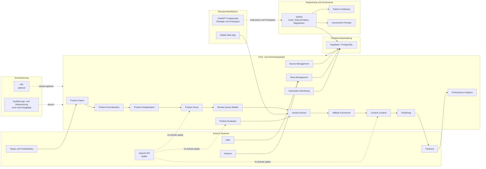
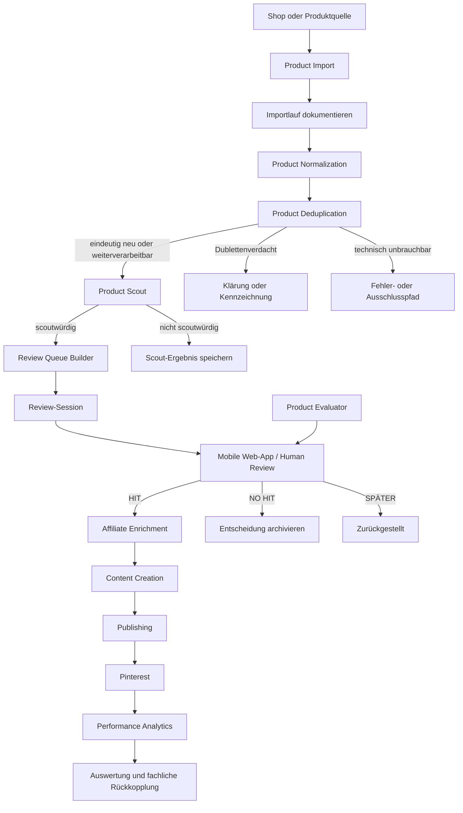

# Solvory – Systemarchitektur

## Dokumentstatus

- **Status:** Entwurf
- **Dokumenttyp:** Zielarchitektur
- **Gültigkeitsbereich:** Solvory-MVP und ausdrücklich gekennzeichnete spätere Ausbaustufen
- **Grundlage:** Bestehende Projektentscheidungen
- **Nicht Bestandteil dieses Dokuments:** Konkrete SQL-Schemata, API-Verträge, Deployment-Konfigurationen und Implementierungscode

## 1. Ziel des Dokuments

Dieses Dokument beschreibt die fachliche und technische Zielarchitektur von Solvory.

Es definiert:

- den Systemkontext,
- Architekturprinzipien,
- zentrale Komponenten,
- Verantwortlichkeiten der Domänenservices,
- den übergeordneten Datenfluss,
- die Trennung von Fachlogik, Orchestrierung, Datenhaltung und Benutzeroberfläche,
- Sicherheitsgrenzen,
- bekannte offene Entscheidungen und Architekturrisiken.

Die aktuell vorhandene Supabase-Datenbank wird als Prototyp behandelt. Sie ist nicht automatisch die verbindliche Zielstruktur.

Die offizielle Datenbankstruktur wird künftig durch versionierte SQL-Migrationen im GitHub-Repository definiert. Dieses Dokument erzeugt noch keine Migrationen.

## 2. Systemkontext

Solvory verarbeitet Produktdaten aus ausgewählten Shops und Affiliate-Grundlagen.

Die Produktdaten werden:

1. importiert,
2. normalisiert,
3. auf Dubletten geprüft,
4. durch einen Product Scout vorausgewählt,
5. in diverse Review-Sessions eingeordnet,
6. dem Nutzer zur Entscheidung vorgelegt,
7. bei Bedarf durch einen Product Evaluator analysiert,
8. nach einer HIT-Entscheidung mit Affiliate-Informationen angereichert,
9. in Content überführt,
10. auf Pinterest veröffentlicht,
11. anhand von Performance-Daten ausgewertet.

Externe Systeme und Plattformen sind insbesondere:

- Shops und Produktfeeds,
- Awin,
- Amazon,
- Pinterest,
- später OpenAI API,
- optional n8n,
- GitHub,
- Supabase.

## 3. Architekturprinzipien

### 3.1 Dokumentation vor Implementierung

Für größere Änderungen gilt:

> Idee → Diskussion → Entscheidung → Dokumentation → Implementierung → Test → Merge

Nicht dokumentierte fachliche oder technische Änderungen dürfen nicht stillschweigend implementiert werden.

### 3.2 Zentrale relationale Datenhaltung

PostgreSQL ist die fachliche Zieldatenbank.

Supabase stellt im aktuellen Zielbild die gehostete PostgreSQL-Umgebung und gegebenenfalls ergänzende Plattformfunktionen bereit.

Die Fachlogik soll soweit möglich mit PostgreSQL-Konzepten arbeiten und nicht unnötig von proprietären Supabase-Funktionen abhängig sein.

### 3.3 Trennung der Verantwortlichkeiten

Die Architektur trennt:

- Fachlogik,
- Datenhaltung,
- Orchestrierung,
- Benutzeroberfläche,
- externe Plattformintegrationen,
- KI-Anbieterintegration.

Keine dieser Schichten soll ohne fachliche Notwendigkeit die Aufgaben einer anderen Schicht übernehmen.

### 3.4 Begrenzte Plattformabhängigkeit

Supabase, n8n, OpenAI API und Pinterest sind konkrete Plattformen oder Dienste.

Ihre Nutzung soll über klar begrenzte Integrationspunkte erfolgen, damit Kernprozesse nicht vollständig an einen einzelnen Anbieter gebunden sind.

### 3.5 Versionierbarkeit

Folgende Artefakte müssen versionierbar sein:

- Anwendungscode,
- technische Dokumentation,
- Architekturentscheidungen,
- SQL-Migrationen,
- Seeds, soweit verwendet,
- Prompt-Versionen,
- Tests,
- Automatisierungsdefinitionen, soweit technisch exportierbar.

GitHub ist dafür die zentrale technische Quelle.

### 3.6 Nachvollziehbarkeit

Wichtige Prozessschritte sollen nachvollziehbar bleiben.

Dazu gehören insbesondere:

- Importläufe,
- Scout-Ergebnisse,
- verwendete Prompt-Versionen,
- Review-Sessions,
- menschliche Entscheidungen,
- Automatisierungsläufe,
- Veröffentlichungen,
- Performance-Daten.

### 3.7 Menschliche Endentscheidung

Die HIT-, NO-HIT- und SPÄTER-Entscheidung wird im MVP durch den Nutzer getroffen.

KI- oder Regelkomponenten dürfen vorbereiten, bewerten und beraten, ersetzen aber nicht die endgültige Entscheidung.

### 3.8 Diversität vor Vollständigkeit

Review-Sessions sollen möglichst abwechslungsreich sein.

Produkte gleicher:

- Marke,
- Quelle,
- Shopzugehörigkeit,
- Kategorie,
- Einsatzart

sollen nach Möglichkeit verteilt werden.

### 3.9 Geheimnisfreiheit im Repository

Zugangsdaten, API-Schlüssel, Passwörter und andere Geheimnisse dürfen nicht gespeichert werden in:

- GitHub,
- Dokumentation,
- Promptdateien,
- Testdaten,
- Protokollen mit unnötigem Klartextbezug.

## 4. Architekturübersicht



## 5. Zentrale Architekturkomponenten

## 5.1 GitHub

### Rolle

GitHub ist die zentrale technische Quelle für:

- Quellcode,
- Dokumentation,
- Datenbankmigrationen,
- Tests,
- versionierte Prompts,
- Automatisierungsartefakte,
- Architekturentscheidungen.

### Repository

Repository:

`solvorybase-ui/base`

Aktueller Arbeitsbranch:

`feature/database-foundation`

Vorhandene Grundstruktur:

```text
solvory/
├── README.md
├── .gitignore
├── docs/
├── database/
│   ├── migrations/
│   └── seeds/
├── backend/
├── prompts/
├── automation/
└── tests/
```

### Git-Workflow

- `main` ist der stabile Branch.
- Größere Änderungen erhalten einen verständlich benannten Feature-Branch.
- Änderungen werden in kleinen, nachvollziehbaren Commits gespeichert.
- Vor dem Merge wird ein Pull Request verwendet.
- Ein zusätzlicher `develop`-Branch ist derzeit nicht vorgesehen.

### Abgrenzung

GitHub ist keine operative Datenbank.

Produktdaten, Performance-Daten und laufende Prozesszustände sollen nicht als primäre Betriebsdaten in Repository-Dateien verwaltet werden.

## 5.2 Supabase/PostgreSQL

### Rolle

Supabase stellt die zentrale PostgreSQL-Datenhaltung bereit.

PostgreSQL speichert insbesondere:

- Shops,
- Importläufe,
- Produkte,
- Bilder,
- Scout-Ergebnisse,
- Review-Sessions,
- Entscheidungen,
- Affiliate-Informationen,
- Content,
- Veröffentlichungen,
- Performance-Daten,
- Automatisierungsläufe,
- Anwendungseinstellungen,
- Prompt-Metadaten.

### Architekturgrenze

Supabase-spezifische Funktionen sollen nur dort verwendet werden, wo sie einen dokumentierten Nutzen bieten.

Die Fachlogik soll nicht unnötig in:

- proprietären Triggern,
- Plattform-Workflows,
- schwer austauschbaren Supabase-spezifischen Mechanismen

gebunden werden.

### Datenbankänderungen

Verbindliche Strukturänderungen erfolgen später über versionierte SQL-Migrationen im Repository.

Direkte manuelle Änderungen in der produktiven Datenbank dürfen nicht zum regulären Änderungsweg werden.

## 5.3 Python

### Rolle

Python ist die primäre Sprache für:

- Produktimport,
- Datenbereinigung,
- Normalisierung,
- Speziallogik,
- Dublettenprüfung,
- fachliche Batch-Verarbeitung,
- Integrationslogik, soweit beschlossen,
- Tests dieser Komponenten.

### Architekturgrenze

Python-Komponenten enthalten Fachlogik und Integrationslogik.

Sie sollen nicht:

- Geheimnisse fest codieren,
- Datenbankstrukturen eigenmächtig verändern,
- unversionierte Prompts verwenden,
- Geschäftsentscheidungen außerhalb dokumentierter Regeln treffen.

## 5.4 OpenAI API

### Rolle

OpenAI API ist für spätere automatisierte KI-Rollen vorgesehen.

Mögliche KI-gestützte Rollen sind:

- Product Scout,
- Product Evaluator,
- Content Creation,
- weitere später beschlossene Analysefunktionen.

### Architekturgrenze

Die KI-Anbieterintegration soll von der Fachlogik getrennt werden.

Fachprozesse sollen nicht voraussetzen, dass ausschließlich ein bestimmtes Modell oder ein einzelner KI-Anbieter verwendet werden kann.

### Prompt-Versionierung

Automatisierte KI-Ausführungen müssen einer nachvollziehbaren Prompt-Version zugeordnet werden können.

### MVP-Einordnung

Der vollständige Einsatz von OpenAI API ist nicht zwingend Bestandteil des ersten MVP-Ausbauschritts. Manuelle oder teilmanuelle Prototypen in ChatGPT-Projektchats bleiben vorübergehend möglich.

## 5.5 n8n

### Rolle

n8n ist eine mögliche Orchestrierungsschicht.

n8n kann später beispielsweise:

- Jobs auslösen,
- Dienste in einer definierten Reihenfolge aufrufen,
- Zeitpläne steuern,
- technische Fehlerpfade koordinieren,
- Benachrichtigungen auslösen.

### Architekturgrenze

n8n soll nicht die primäre Heimat komplexer Fachlogik werden.

Fachliche Regeln wie:

- Scout-Kriterien,
- Dublettenentscheidungen,
- Review-Diversität,
- Statusübergänge,
- Berechtigungsregeln

sollen in versionierter Anwendungslogik oder klar dokumentierten Datenbankregeln liegen.

### Offener Status

Der konkrete Einsatz von n8n im MVP ist noch nicht abschließend entschieden.

## 5.6 Mobile Web-App

### Rolle

Die mobile Web-App dient der menschlichen Produktreview.

Die erste MVP-Review-App wird mobile-first mit FastAPI und serverseitig
gerendertem HTML im bestehenden Python-Backend umgesetzt. Sie ist keine
separate SPA und verwendet weder React noch Next.js. Dafür wird keine neue
Microservice-Architektur eingeführt.

Sie soll mindestens ermöglichen:

- Zugriff über einen dauerhaft nutzbaren, schwer erratbaren Link mit
  serverseitig validiertem kryptografisch zufälligem Token,
- Anzeige relevanter Produktinformationen,
- Anzeige des nächsten noch nicht entschiedenen Produkts,
- kontinuierlichen Review-Fluss über interne Sessiongrenzen hinweg,
- HIT-Entscheidung,
- NO-HIT-Entscheidung,
- SPÄTER-Entscheidung,
- automatischer Wechsel zum nächsten Produkt nach erfolgreicher Entscheidung.

Review-Sessions mit standardmäßig 20 Produkten und ihre IDs bleiben interne
organisatorische Einheiten. Sie sind nicht der primäre Navigationsweg. Ist eine
offene Session vollständig bearbeitet, stellt die Anwendung bei vorhandenen
reviewfähigen Kandidaten nahtlos die nächste Session bereit. Ohne Kandidaten
wird keine leere Session erzeugt, sondern eine verständliche Fertigansicht
angezeigt.

Der gleiche gültige Review-Link ist auf mehreren Geräten nutzbar. PostgreSQL
ist die zentrale Wahrheit für den Bearbeitungsstand. Jeder Request validiert
Token, Session-Item und aktuellen Entscheidungsstand serverseitig. Veraltete
oder bereits entschiedene Items dürfen nicht doppelt bewertet werden; bei
Parallelitätskonflikten wird kontrolliert das nächste aktuelle Produkt geladen.
Der Klartext-Token wird nicht persistiert. PostgreSQL speichert ausschließlich
seinen SHA-256-Hash sowie die stabile UUID und den Erstellungs- und optionalen
Widerrufszeitpunkt des Review-Link-Datensatzes. Die konkrete physische
Schemaumsetzung und Locking-Architektur bleiben gesonderten Schritten
vorbehalten.

Der Product Evaluator und administrative NO-HIT-Overrides sind nicht
Bestandteil dieser ersten Oberfläche.

### Architekturgrenze

Die mobile Web-App ist eine Benutzeroberfläche.

Sie soll nicht eigenständig:

- Produkte importieren,
- Dublettenlogik ausführen,
- Scout-Entscheidungen berechnen,
- Affiliate-Daten erzeugen,
- Content veröffentlichen.

HTTP-Routen und Templates verwenden dafür die bestehenden Review Candidate-,
Review Session- und Human Review Decision Services. Sie duplizieren keine
Eligibility- oder Decision-Logik und führen keine direkten SQL-Schreibzugriffe
aus.

## 5.7 Pinterest

### Rolle

Pinterest ist die erste Veröffentlichungsplattform.

Solvory übergibt vorbereitete Content-Assets an den Publishing-Prozess und dokumentiert die erfolgte Veröffentlichung.

### Architekturgrenze

Pinterest ist ein externer Vertriebskanal und nicht die zentrale Quelle für Produkt-, Content- oder Entscheidungsdaten.

Die interne Solvory-Datenbank bleibt führend für:

- Produktzuordnung,
- Content-Zuordnung,
- Publikationsstatus,
- Performance-Rückführung.

## 5.8 ChatGPT-Projektchats

### Rolle

ChatGPT-Projektchats dienen derzeit für:

- Strategie,
- Architektur,
- Promptentwicklung,
- fachliche Diskussion,
- Sonderfälle,
- manuelle Prototypen.

### Architekturgrenze

ChatGPT-Projektchats sind:

- keine operative Datenbank,
- keine verlässliche Ausführungswarteschlange,
- kein Ersatz für versionierte Dokumentation,
- keine dauerhafte Ablage für Produktzustände.

Relevante Ergebnisse müssen in GitHub-Dokumentation, Prompts oder später in der zentralen Datenbank übernommen werden.

## 6. Domänenservices und Verantwortlichkeiten

Die Bezeichnung „Service“ beschreibt eine fachlich abgegrenzte Verantwortlichkeit. Ein Service muss im MVP nicht zwingend ein eigenständig deployter Microservice sein.

## 6.1 Source Management

Verantwortlich für:

- Verwaltung möglicher Produktquellen,
- Status und grundsätzliche Freigabe von Quellen,
- Dokumentation der Importfähigkeit,
- Zuordnung zu technischen Importwegen.

Nicht verantwortlich für:

- Produktauswahl,
- HIT-Entscheidung,
- Affiliate-Anreicherung einzelner Produkte.

## 6.2 Shop Management

Verantwortlich für:

- Verwaltung von Shops,
- fachliche Shopbewertung,
- Affiliate-Netzwerk-Zuordnung,
- Freigabe oder Sperrung eines Shops als Produktquelle,
- Pflege shopbezogener Metadaten.

Nicht verantwortlich für:

- Scout-Entscheidung einzelner Produkte,
- menschliche HIT-Entscheidung.

## 6.3 Product Import

Verantwortlich für:

- technische Übernahme von Produktdaten,
- Zuordnung zum Shop und Importlauf,
- Speicherung importierter Rohinformationen,
- Dokumentation von Importerfolg und Importfehlern.

Nicht verantwortlich für:

- inhaltliche Produktbewertung,
- endgültige Dublettenentscheidung außerhalb definierter Regeln,
- Review-Entscheidungen.

## 6.4 Product Normalization

Verantwortlich für:

- Vereinheitlichung importierter Produktinformationen,
- Standardisierung von Formaten,
- Bereinigung technisch unbrauchbarer Werte,
- Vorbereitung für nachfolgende Verarbeitung.

Nicht verantwortlich für:

- inhaltliche HIT-Entscheidung,
- Änderung fachlicher Aussagen ohne dokumentierte Regel.

## 6.5 Product Deduplication

Verantwortlich für:

- Erkennung möglicher Dubletten,
- Anwendung dokumentierter Dublettenregeln,
- Vermeidung mehrfacher Verarbeitung identischer Produkte,
- Kennzeichnung unklarer Fälle.

Nicht verantwortlich für:

- eigenmächtige Löschung fachlich relevanter Historie,
- Produktbewertung nach Solvory-Nutzen.

## 6.6 Product Scout

Verantwortlich für:

- Vorauswahl potenziell relevanter Produkte,
- Bewertung von Nützlichkeit und funktionaler Besonderheit,
- Dokumentation der Scout-Begründung,
- Nutzung einer nachvollziehbaren Prompt- oder Regelversion.

Nicht verantwortlich für:

- HIT oder NO HIT,
- Affiliate-Auswahl,
- Veröffentlichung.

## 6.7 Review Queue Builder

Verantwortlich für:

- Aufbau von Review-Sessions,
- Auswahl scoutwürdiger und reviewfähiger Produkte,
- Diversität innerhalb und zwischen Sessions,
- Vermeidung unnötiger Häufungen ähnlicher Produkte,
- nachvollziehbare Session-Zuordnung.

Nicht verantwortlich für:

- Produktbewertung,
- HIT-Entscheidung.

## 6.8 Human Review

Verantwortlich für:

- Darstellung der Produkte für den Nutzer,
- Erfassung der menschlichen Entscheidung,
- eindeutige Zuordnung der Entscheidung zum Produkt und zur Review-Session,
- Schutz vor unbeabsichtigten Mehrfachentscheidungen.

Die eigentliche Entscheidung trifft der Nutzer.

## 6.9 Product Evaluator

Verantwortlich für:

- kritische Analyse ausgewählter Produkte,
- Darstellung von Nutzen, Differenzierung, Zielgruppe, Potenzial und Risiken,
- Unterstützung der menschlichen Entscheidung.

Nicht verantwortlich für:

- endgültige HIT-Entscheidung,
- automatische Veröffentlichung.

## 6.10 Affiliate Enrichment

Verantwortlich für:

- Anreicherung bestätigter HIT-Produkte,
- Zuordnung von Affiliate-Netzwerk und Affiliate-Link,
- Dokumentation des Prüf- und Aktivitätsstatus.

Nicht verantwortlich für:

- Änderung der Produktentscheidung,
- Produktauswahl aufgrund der Provisionshöhe.

## 6.11 Content Creation

Verantwortlich für:

- Erstellung produktbezogener Content-Assets,
- Verwendung bestätigter Produkt- und Affiliate-Informationen,
- Zuordnung zu einer Prompt-Version, sofern KI-gestützt,
- Vorbereitung plattformspezifischer Inhalte.

Nicht verantwortlich für:

- eigenständige Veröffentlichung ohne Publishing-Prozess,
- Änderung der HIT-Entscheidung.

## 6.12 Publishing

Verantwortlich für:

- Übergabe freigegebener Inhalte an Pinterest,
- Dokumentation des Veröffentlichungsstatus,
- Erfassung externer Publikationsreferenzen,
- kontrollierte Wiederholung bei technischen Fehlern.

Nicht verantwortlich für:

- Content-Bewertung,
- HIT-Entscheidung,
- Performance-Auswertung.

## 6.13 Performance Analytics

Verantwortlich für:

- Erfassung und Aufbereitung von Performance-Daten,
- Zuordnung zu Veröffentlichung und Produkt,
- Berechnung oder Bereitstellung vereinbarter Kennzahlen,
- Rückführung der Ergebnisse in spätere Analysen.

Nicht verantwortlich für:

- nachträgliche Veränderung historischer Entscheidungen,
- automatische Produktfreigabe ohne dokumentierte Regel.

## 6.14 Automation Monitoring

Verantwortlich für:

- Dokumentation technischer Automatisierungsläufe,
- Erkennung fehlgeschlagener oder unvollständiger Läufe,
- Bereitstellung von Fehlerkontext,
- Unterstützung von Wiederholungs- und Eskalationsprozessen.

Nicht verantwortlich für:

- fachliche Produktentscheidungen,
- stillschweigende Korrektur fehlerhafter Daten.

## 7. Übergeordneter Datenfluss



## 8. Trennung der Architekturschichten

## 8.1 Fachlogik

Zur Fachlogik gehören unter anderem:

- Scout-Kriterien,
- Dublettenregeln,
- Regeln für Review-Diversität,
- zulässige Statusübergänge,
- Voraussetzungen für Affiliate-Anreicherung,
- Voraussetzungen für Veröffentlichung.

Fachlogik soll versioniert, testbar und außerhalb reiner Orchestrierungsoberflächen nachvollziehbar sein.

## 8.2 Orchestrierung

Orchestrierung entscheidet:

- wann ein Prozess gestartet wird,
- in welcher Reihenfolge Services aufgerufen werden,
- wie technische Wiederholungen erfolgen,
- wann ein Fehler eskaliert wird.

Orchestrierung soll nicht eigenmächtig fachliche Bewertungen verändern.

## 8.3 Datenhaltung

PostgreSQL hält den maßgeblichen fachlichen Zustand.

Die Datenhaltung soll:

- Beziehungen konsistent speichern,
- Historie soweit erforderlich bewahren,
- parallele oder widersprüchliche Bearbeitung vermeiden,
- technische Nachvollziehbarkeit unterstützen.

## 8.4 Benutzeroberfläche

Die mobile Web-App zeigt Daten an und erfasst Benutzeraktionen.

Sie ist nicht die führende Instanz für fachliche Regeln.

Im MVP wird sie als serverseitig gerenderte FastAPI-Oberfläche innerhalb des
bestehenden Python-Backends umgesetzt.

Der primäre Einstieg erfolgt über einen serverseitig validierten tokenbasierten
Review-Link und nicht über eine dem Nutzer bekannte Session-ID. Fachlicher
Fortschritt wird ausschließlich aus dem zentralen Datenbankzustand abgeleitet,
nicht aus lokalem Browserzustand.

## 8.5 Integrationen

Externe Integrationen verbinden Solvory mit:

- Shops,
- Affiliate-Netzwerken,
- KI-Anbietern,
- Pinterest.

Integrationen sollen externe Daten in interne Modelle übersetzen, ohne externe Datenstrukturen unkontrolliert in die Kernarchitektur zu übernehmen.

## 9. Datenverantwortung und Schreibrechte

| Domäne | Primär schreibender Service | Weitere zulässige Schreiber |
|---|---|---|
| Quellen | Source Management | noch festzulegen |
| Shops | Shop Management | Import kann technische Referenzen nutzen, aber keine fachliche Freigabe ändern |
| Importläufe | Product Import | Automation Monitoring für Laufstatus nur nach definierter Regel |
| Produkte | Product Import, Product Normalization | Product Deduplication für Dublettenstatus nach definierter Regel |
| Produktbilder | Product Import, Product Normalization | noch festzulegen |
| Prompt-Versionen | Prompt-Verwaltung über versionierten Prozess | KI-Rollen nur lesend |
| Scout-Ergebnisse | Product Scout | keine anderen Fachservices |
| Review-Sessions | Review Queue Builder | Human Review nur für zulässigen Sessionstatus |
| Reviews | Human Review | keine automatisierte Änderung der menschlichen Entscheidung |
| Affiliate-Links | Affiliate Enrichment | Publishing nur lesend |
| Content-Assets | Content Creation | Publishing nur für Veröffentlichungsbezug |
| Veröffentlichungen | Publishing | Performance Analytics nur lesend beziehungsweise zuordnend |
| Performance-Daten | Performance Analytics | keine nachträgliche Änderung durch Publishing |
| Automatisierungsläufe | Automation Monitoring beziehungsweise Orchestrierung | beteiligte Worker für technischen Laufstatus nach Regel |
| Anwendungseinstellungen | noch festzulegender administrativer Service | Fachservices nur lesend, sofern nicht ausdrücklich erlaubt |

Die konkrete technische Berechtigungsmatrix ist noch nicht beschlossen.

## 10. Sicherheitsgrenzen

## 10.1 Vertrauensgrenzen

Folgende Übergänge gelten als Sicherheitsgrenzen:

1. Externe Shops zu Solvory.
2. Affiliate-Netzwerke zu Solvory.
3. Solvory zu OpenAI API.
4. Solvory zu Pinterest.
5. Mobile Web-App zum Backend.
6. Orchestrierung zu ausführenden Services.
7. Anwendung zur Datenbank.
8. Entwicklerzugriff zu GitHub und Supabase.

## 10.2 Externe Produktdaten

Externe Produktdaten gelten grundsätzlich als nicht vertrauenswürdig.

Sie müssen vor Verarbeitung:

- technisch validiert,
- normalisiert,
- auf unerwartete Inhalte geprüft,
- auf unvollständige oder fehlerhafte Werte geprüft werden.

Produktbeschreibungen und externe Texte dürfen nicht ungeprüft als Steueranweisungen für KI-Systeme behandelt werden.

## 10.3 Geheimnisse

Geheimnisse müssen außerhalb des Repositorys verwaltet werden.

Dazu gehören:

- Datenbankzugänge,
- API-Schlüssel,
- Pinterest-Zugänge,
- Affiliate-Zugangsdaten,
- OpenAI-API-Schlüssel,
- n8n-Zugangsdaten,
- Signierschlüssel und Tokens.

Der konkrete Secret-Management-Dienst ist noch nicht entschieden.

## 10.4 Benutzerzugriff

Die mobile Web-App darf Review-Entscheidungen nur für autorisierte Benutzer ermöglichen.

Im ersten MVP dient ein kryptografisch zufälliger, serverseitig validierter
Token im dauerhaft nutzbaren Review-Link als Zugriffsschlüssel; ein klassischer
Login ist nicht erforderlich. Der Token darf nicht im Klartext protokolliert
oder persistiert werden. Gespeichert wird ausschließlich der SHA-256-Hash des
vollständigen Tokens. Ein Widerrufszeitpunkt deaktiviert den zugehörigen Link;
eine bloß lange URL ohne serverseitige Prüfung ist unzulässig.

Jeder Review-Link besitzt eine nicht geheime interne UUID. Aus ihr erzeugt der
Server die Benutzerreferenz `review_link:<token_record_id>` und übergibt sie an
den Human Review Decision Service. Der Browser darf diese Referenz nicht frei
bestimmen. Derselbe gültige Link kann auf mehreren Geräten dieselbe
Review-Identität repräsentieren.

Zu klären sind:

- konkrete physische Schemaumsetzung und betriebliche Token-Verwaltung,
- Hostname und Bereitstellung des Review-Links,
- Schutz vor unbeabsichtigten Mehrfachaktionen,
- Auditierbarkeit von Entscheidungen.

## 10.5 KI-Datenschutz

Vor dem Einsatz externer KI-Anbieter ist zu dokumentieren:

- welche Daten übertragen werden,
- ob personenbezogene Daten enthalten sein können,
- wie Daten minimiert werden,
- welche Aufbewahrungs- und Trainingsbedingungen gelten,
- welche Modelle und Regionen zulässig sind.

Im Produktprozess sollten im Regelfall keine personenbezogenen Endkundendaten erforderlich sein.

## 10.6 Veröffentlichungsschutz

Publishing darf nur Inhalte veröffentlichen, die:

- einem bestätigten HIT zugeordnet sind,
- den vorgesehenen Freigabestatus besitzen,
- einen gültigen Plattformbezug haben,
- nicht bereits unbeabsichtigt doppelt veröffentlicht wurden.

Die konkreten Freigabestufen sind noch nicht beschlossen.

## 11. Deployment- und Laufzeitarchitektur

Die konkrete Laufzeit- und Deployment-Architektur ist noch nicht beschlossen.

Insbesondere offen sind:

- Hosting des Python-Backends,
- Hosting der mobilen Web-App,
- technische Jobsteuerung,
- Verwendung von Supabase Edge Functions,
- Verwendung von Containerdiensten,
- Einsatz von n8n Cloud oder Self-Hosting,
- Trennung von Entwicklungs-, Test- und Produktionsumgebung.

Diese Entscheidungen dürfen nicht aus dem bestehenden Repository-Namen oder dem aktuellen Supabase-Prototyp abgeleitet werden.

## 12. Beobachtbarkeit und Fehlerdiagnose

Die Architektur soll technische Nachvollziehbarkeit ermöglichen.

Mindestens erforderlich sind:

- eindeutige Automatisierungsläufe,
- Laufstatus,
- Start- und Endzeit,
- beteiligte Verarbeitungsschritte,
- Fehlerkategorie,
- nachvollziehbarer Zusammenhang zum betroffenen Import, Produkt oder Publishing-Vorgang.

Die konkrete Logging- und Monitoring-Plattform ist noch nicht entschieden.

## 13. MVP-Abgrenzung

Zum MVP gehören:

- ein zentraler Produktdatenprozess,
- menschliche Review,
- Affiliate-Anreicherung,
- Pinterest-Content,
- Pinterest-Veröffentlichung,
- grundlegende Performance-Rückführung.

Nicht zum MVP gehören:

- vollautonome Produktauswahl,
- Multi-Plattform-Publishing,
- eigene Zahlungsabwicklung,
- eigener Marktplatz,
- umfassende Endkundenprofile,
- vollständige Echtzeitarchitektur,
- verpflichtende Microservice-Aufteilung.

## 14. Architekturrisiken

### 14.1 Prototyp wird unbeabsichtigt zum Standard

Die bestehende Supabase-Struktur könnte ohne formelle Prüfung als verbindliches Schema übernommen werden.

### 14.2 Fachlogik wandert in n8n

Bei intensiver Nutzung von n8n besteht das Risiko, dass wichtige Regeln in schwer testbaren Workflows verteilt werden.

### 14.3 Unklare Servicegrenzen

Die genannten Services sind fachliche Domänenrollen. Ohne weitere Entscheidung könnte vorschnell eine unnötig komplexe Microservice-Architektur entstehen.

### 14.4 Unklare Statusmodelle

Für Produkte, Scout-Ergebnisse, Reviews, Content und Veröffentlichungen sind noch keine verbindlichen Statusübergänge dokumentiert.

### 14.5 Fehlende Berechtigungsmatrix

Die fachlichen Schreibverantwortungen sind grob beschrieben, aber noch nicht in technische Datenbank- und API-Berechtigungen übersetzt.

### 14.6 Externe Plattformabhängigkeit

Änderungen an Pinterest, Affiliate-Feeds, OpenAI API oder Supabase können den Prozess beeinflussen.

### 14.7 Dublettenfehler

Zu aggressive Dublettenlogik kann relevante Produkte zusammenführen. Zu schwache Dublettenlogik kann Review-Sessions und Analysen verfälschen.

### 14.8 Unkontrollierte KI-Ausgaben

Ohne strukturierte Validierung können KI-Ausgaben unvollständig, widersprüchlich oder nicht reproduzierbar sein.

## 15. Offene Entscheidungen

- Welche Laufzeitplattform hostet Python-Backend und Worker?
- Wird n8n im MVP eingesetzt?
- Welche Prozesse werden synchron und welche asynchron ausgeführt?
- Wie werden Review-Link-Tokens betrieblich erzeugt, ausgegeben, widerrufen und
  ersetzt?
- Welche Rollen und Datenbankrechte werden benötigt?
- Wie werden Secrets verwaltet?
- Welche Umgebungen werden eingerichtet?
- Welche Logging- und Monitoring-Lösung wird eingesetzt?
- Welche Komponenten dürfen Produktstatus verändern?
- Wie wird der Rückweg von Performance-Daten aus Pinterest technisch umgesetzt?
- Welche Teile der OpenAI-Integration gehören zum ersten MVP-Ausbauschritt?

---

# Verbindliche Einarbeitung der fachlichen Entscheidungen

Die folgenden Punkte ersetzen entgegenstehende oder noch offene Formulierungen im vorstehenden Entwurf:

1. Fachliche Services sind verbindliche Verantwortlichkeitsgrenzen, aber keine automatisch getrennt deployten Microservices.
2. Es gibt keinen globalen Produktstatus. Import, Scout, Review, Affiliate, Content und Publishing führen eigene Domänenzustände.
3. `workspaces` gehören nicht zum MVP. Es gibt genau einen organisatorischen Datenkontext.
4. Source Management ist fachlich relevant, aber noch nicht vollständig modelliert. Ein Shop kann mehrere technische Quellen besitzen.
5. Die bevorzugte Quellenreihenfolge lautet: offizielle API, offizieller Feed, CSV/XML, strukturierte Website-Daten, Scraping. Abweichungen sind bei nachweislich besserer Datenqualität zulässig und zu dokumentieren.
6. Der Product Scout prüft ausschließlich neue Produkte und nimmt bei fachlicher Unsicherheit eher auf.
7. Product Evaluator wird im MVP nur auf ausdrückliche Nutzeranforderung ausgeführt; Ergebnisse werden nicht dauerhaft operativ gespeichert.
8. Nach HIT startet die Orchestrierung Affiliate Enrichment und Content Creation parallel.
9. Publishing unterstützt sofortige und geplante Veröffentlichung und prüft zwingend einen gültigen Ziel-Link.
10. KI-Ausführungen speichern strukturierte Endergebnisse sowie Prompt-Version, Modell beziehungsweise Modellversion, Ausführungszeitpunkt und technischen Status; vollständige Dialoge und unnötige Rohantworten werden nicht dauerhaft gespeichert.
11. Dasselbe fachliche Produkt kann mehrere Angebote beziehungsweise Bezugsquellen besitzen.
12. Produktvarianten werden als Produktfamilie mit zugeordneten Varianten modelliert.
13. Alle verfügbaren Produktbilder werden grundsätzlich referenziert beziehungsweise gespeichert.
14. Produkte dürfen ohne Affiliate-Link importiert, gescoutet, evaluiert und menschlich bewertet werden.
