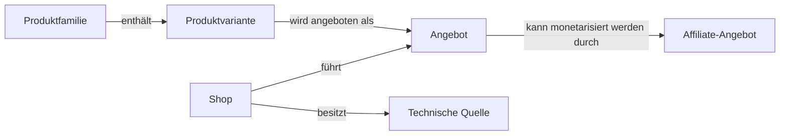
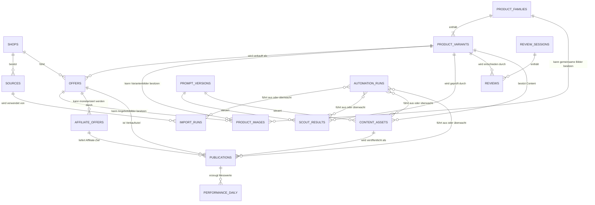

# Solvory – Fachliches Datenmodell

## Dokumentstatus

- **Status:** Entwurf
- **Dokumenttyp:** Fachliches Domänenmodell
- **Gültigkeitsbereich:** Solvory-MVP sowie ausdrücklich gekennzeichnete spätere Domänen
- **Technischer Detailgrad:** Fachlich, nicht spaltenweise
- **Grundlage:** Beschlossene fachliche und technische Projektentscheidungen
- **Nicht Bestandteil dieses Dokuments:** SQL, Datentypen, Indizes, Constraints, RLS-Regeln, API-Verträge und Implementierungsdetails

## 1. Ziel des Datenmodells

Dieses Dokument beschreibt die fachlichen Entitäten und Beziehungen der Solvory-Plattform.

Das Modell soll insbesondere ermöglichen:

- Shops und technische Produktquellen klar voneinander zu trennen,
- fachliche Produkte unabhängig von einzelnen Shops zu verwalten,
- Produktfamilien, Produktvarianten und konkrete Angebote zu unterscheiden,
- mehrere Angebote desselben Produkts abzubilden,
- Affiliate-Informationen auf konkrete Angebote zu beziehen,
- Import-, Scout-, Review-, Content-, Publishing- und Performance-Prozesse nachvollziehbar zu halten,
- Zuständigkeiten und Schreibverantwortungen je fachlichem Service zu definieren,
- spätere Erweiterungen zu ermöglichen, ohne den MVP unnötig zu vergrößern.

Die aktuelle Supabase-Datenbank gilt als Prototyp. Dieses Dokument beschreibt das fachliche Zielmodell und nicht automatisch den bestehenden technischen Ist-Zustand.

## 2. Geltungsbereich des MVP

Solvory verwendet im MVP genau einen organisatorischen Datenkontext.

Eine Workspace- oder Mandantenentität gehört nicht zum MVP-Datenmodell.

Mandantenfähigkeit darf später nur durch eine neue Architekturentscheidung eingeführt werden.

## 3. Modellierungsgrundsätze

### 3.1 Zentrale relationale Datenhaltung

PostgreSQL ist die führende operative Datenhaltung.

Die verbindliche technische Struktur wird später über versionierte SQL-Migrationen definiert.

### 3.2 Fachliche Identität vor technischer Herkunft

Ein fachliches Produkt ist nicht mit einem Shopdatensatz, einer Produkt-URL oder einem Feed-Eintrag gleichzusetzen.

Mehrere externe Datensätze können dasselbe fachliche Produkt oder dieselbe Produktvariante beschreiben.

### 3.3 Trennung von Produkt, Variante und Angebot

Das Modell unterscheidet verbindlich:

1. **Produktfamilie**  
   Der fachliche Zusammenhang mehrerer verwandter Varianten.

2. **Produktvariante**  
   Eine konkrete, funktional oder kaufrelevant unterscheidbare Ausprägung innerhalb einer Produktfamilie.

3. **Angebot**  
   Die konkrete Verkaufsmöglichkeit einer Produktvariante bei genau einem Shop.

Die fachliche Grundbeziehung lautet:

> Produktfamilie → Produktvariante → Angebot

Ein Angebot ist kein eigenständiges fachliches Produkt.

### 3.4 Shop und technische Quelle sind getrennt

Ein Shop ist eine fachliche Verkaufsplattform.

Eine technische Quelle ist ein konkreter Datenzugang, über den Solvory Informationen bezieht.

Ein Shop kann mehrere technische Quellen besitzen.

### 3.5 Affiliate-Informationen beziehen sich auf Angebote

Affiliate-Informationen beziehen sich nicht direkt auf die abstrakte Produktfamilie.

Ein Affiliate-Angebot erweitert ein konkretes Shopangebot um Affiliate-Programm-, Tracking-, Provisions- und Linkinformationen.

### 3.6 Kein globaler Produktstatus

Es gibt keinen einzelnen Status, der Import, Scout, Review, Affiliate, Content und Publishing zusammenfasst.

Die Zustände werden in den jeweiligen Domänen geführt.

Eine Produktvariante kann beispielsweise gleichzeitig folgende Zustände besitzen:

- menschliche Entscheidung: HIT,
- Content: erstellt,
- Affiliate-Angebot: noch nicht verfügbar,
- Publishing: blockiert.

### 3.7 Historische Nachvollziehbarkeit

Wesentliche fachliche und technische Ereignisse dürfen nicht durch bloßes Überschreiben verloren gehen.

Dies betrifft insbesondere:

- Importläufe,
- Scout-Ergebnisse,
- menschliche Entscheidungen,
- Affiliate-Prüfungen,
- Content-Versionen,
- Veröffentlichungen,
- Performance-Daten,
- Automatisierungsläufe.

### 3.8 Technische Fehler sind keine fachlichen Entscheidungen

Ein Importfehler, KI-Fehler oder Publishing-Fehler darf nicht als fachliche Ablehnung eines Produkts interpretiert werden.

### 3.9 Begrenzte Schreibverantwortung

Jede Entität besitzt einen primär verantwortlichen fachlichen Service.

Andere Services dürfen nur innerhalb ausdrücklich definierter Grenzen schreiben.

### 3.10 Archivierung vor physischer Löschung

Historisch oder analytisch relevante Daten werden grundsätzlich deaktiviert oder archiviert, nicht unkontrolliert physisch gelöscht.

## 4. Fachliche Kernstruktur

## 5. Fachliche Entitäten des MVP

## 5.1 `shops`

### Fachlicher Zweck

`shops` repräsentieren fachliche Verkaufsplattformen beziehungsweise Händler, bei denen Produkte erworben werden können.

Ein Shop ist nicht mit einer technischen Datenquelle gleichzusetzen.

### Wichtigste fachliche Informationen

- Identität und Name des Shops,
- fachliche Beschreibung,
- Region und Liefergebiet,
- Shopvertrauen,
- Solvory-Eignung,
- Freigabe-, Sperr- oder Aktivitätszustand,
- bekannte Affiliate-Grundlagen,
- fachliche Prüfzeitpunkte.

### Beziehungen

Ein Shop:

- kann mehrere technische Quellen besitzen,
- kann viele Angebote führen,
- kann an mehreren Affiliate-Programmen beteiligt sein,
- kann indirekt über seine Angebote und Veröffentlichungen ausgewertet werden.

Ein Angebot gehört immer zu genau einem Shop.

### Verantwortlicher Schreib-Service

**Shop Management**

Source Management darf technische Quellenbeziehungen pflegen, verändert aber nicht eigenmächtig die fachliche Shopfreigabe.

### Lebenszyklus

Mögliche fachliche Phasen:

- neu,
- in Prüfung,
- freigegeben,
- zurückgestellt,
- abgelehnt,
- deaktiviert,
- archiviert.

Die endgültigen Statusbezeichnungen werden vor der Implementierung festgelegt.

### Lösch- und Archivierungsregeln

Shops mit historischen Quellen, Angeboten, Affiliate-Angeboten oder Veröffentlichungsbezügen werden nicht physisch gelöscht.

## 5.2 `sources`

### Fachlicher Zweck

`sources` repräsentieren technische Datenzugänge, über die Solvory Produkt-, Varianten-, Angebots- oder Bildinformationen bezieht.

Die Entität trennt die technische Herkunft der Daten vom fachlichen Shop.

### Typische Quellenarten

- offizielle API,
- offizieller Produktfeed,
- strukturierter CSV-Export,
- strukturierter XML-Export,
- Sitemap,
- strukturierte Website-Daten,
- Scraping.

### Bevorzugte Quellenreihenfolge

Die bevorzugte Reihenfolge lautet:

1. offizielle API,
2. offizieller Produktfeed,
3. strukturierter CSV- oder XML-Export,
4. Sitemap oder strukturierte Website-Daten,
5. Scraping als letzter Weg.

Von dieser Reihenfolge darf abgewichen werden, wenn eine andere Quelle nachweislich bessere Datenqualität liefert.

Die tatsächlich verwendete Quelle wird pro Shop dokumentiert.

### Wichtigste fachliche Informationen

- zugehöriger Shop,
- Quellenart,
- fachlicher Zweck,
- bereitgestellte Datenarten,
- regionale oder katalogbezogene Abdeckung,
- bekannte Qualitätsgrenzen,
- Freigabe- und Aktivitätszustand,
- Begründung der Quellenwahl.

Technische Zugangsdaten sind keine fachlichen Informationen dieser Entität und dürfen nicht im Datenmodell als Klartext gespeichert werden.

### Beziehungen

Eine technische Quelle:

- gehört fachlich zu genau einem Shop,
- kann von mehreren Importläufen verwendet werden,
- kann Produkte, Varianten, Angebote und Bilder liefern,
- kann später durch die Domäne Source Health überwacht werden.

Ein Shop kann mehrere technische Quellen besitzen.

### Verantwortlicher Schreib-Service

**Source Management**

Product Import liest freigegebene Quellen und ordnet Importläufe einer Quelle zu.

### Lebenszyklus

Mögliche fachliche Phasen:

- identifiziert,
- in Prüfung,
- freigegeben,
- aktiv,
- eingeschränkt,
- deaktiviert,
- ersetzt,
- archiviert.

### Lösch- und Archivierungsregeln

Quellen mit historischen Importläufen werden nicht physisch gelöscht.

Eine ersetzte oder nicht mehr nutzbare Quelle wird deaktiviert oder archiviert.

## 5.3 `import_runs`

### Fachlicher Zweck

`import_runs` dokumentieren einen konkreten Import aus genau einer technischen Quelle.

### Wichtigste fachliche Informationen

- verwendete Quelle,
- zugehöriger Shop über die Quelle,
- Start und Ende,
- technischer Ausgang,
- Umfang des Imports,
- Anzahl verarbeiteter, übernommener und fehlerhafter Datensätze,
- Fehlerzusammenfassung,
- verwendete Importlogik beziehungsweise deren Version.

### Beziehungen

Ein Importlauf:

- gehört zu genau einer technischen Quelle,
- kann Produktfamilien, Produktvarianten, Angebote und Bilder neu erkennen oder aktualisieren,
- kann mit einem Automatisierungslauf verbunden sein.

Die detaillierte technische Zuordnung jedes importierten Quelldatensatzes wird vor der SQL-Modellierung gesondert konkretisiert.

### Verantwortlicher Schreib-Service

**Product Import**

### Lebenszyklus

- geplant,
- gestartet,
- laufend,
- erfolgreich,
- teilweise erfolgreich,
- fehlgeschlagen,
- abgebrochen.

### Lösch- und Archivierungsregeln

Importläufe werden als historische Betriebsdaten aufbewahrt.

## 5.4 `product_families`

### Fachlicher Zweck

`product_families` repräsentieren den gemeinsamen fachlichen Zusammenhang verwandter Produktvarianten.

Eine Produktfamilie bündelt Varianten, die dasselbe grundlegende Produktkonzept oder dieselbe Kernfunktion teilen.

### Abgrenzung

Eine Produktfamilie ist:

- kein Shopangebot,
- keine einzelne kaufbare Ausprägung,
- keine Affiliate-Verknüpfung,
- kein globaler Prozessstatus.

### Beispiele für mögliche Variantenunterschiede

- Größe,
- Farbe,
- Leistung,
- Ausstattung,
- Kapazität,
- Material,
- Generation,
- regionale Ausführung,
- Set-Umfang.

Nicht jeder geringfügige Unterschied muss zwangsläufig eine eigenständige fachliche Variante begründen. Die fachlichen Identitätsregeln werden später dokumentiert.

### Wichtigste fachliche Informationen

- gemeinsame Produktbezeichnung,
- Marke, soweit vorhanden,
- gemeinsames Produktkonzept,
- gemeinsame Funktionsbeschreibung,
- übergeordnete Kategorie,
- gemeinsame Nutzen- und Innovationsmerkmale.

### Beziehungen

Eine Produktfamilie:

- besitzt eine oder mehrere Produktvarianten,
- kann gemeinsame Bilder oder Beschreibungsbestandteile besitzen,
- wird nicht direkt einem Shop oder Affiliate-Angebot zugeordnet.

### Verantwortliche Schreib-Services

- Product Import für erstmalige Erkennung,
- Product Normalization für fachliche Vereinheitlichung,
- Product Deduplication für Zusammenführung und Identitätsklärung.

### Lebenszyklus

Eine Produktfamilie kann:

- aktiv,
- ersetzt,
- nicht mehr verfügbar,
- archiviert

sein.

Import-, Scout-, Review-, Affiliate-, Content- und Publishing-Zustände gehören nicht in diese Entität.

### Lösch- und Archivierungsregeln

Produktfamilien mit Varianten oder Prozesshistorie werden nicht physisch gelöscht.

## 5.5 `product_variants`

### Fachlicher Zweck

`product_variants` repräsentieren konkrete, fachlich relevante Ausprägungen einer Produktfamilie.

Die Produktvariante ist die zentrale Einheit für Scout, Review und HIT-/NO-HIT-/SPÄTER-Entscheidungen, sofern die Variante einen eigenständigen kauf- oder bewertungsrelevanten Unterschied besitzt.

### Wichtige fachliche Klarstellung

Nicht alle extern als Varianten bezeichneten Unterschiede müssen eine eigenständige fachliche Produktvariante erzeugen.

Beispielsweise kann eine reine Farbauswahl fachlich weniger relevant sein als eine andere Größe, Leistung oder Funktion.

Die genaue Abgrenzung erfolgt durch später zu dokumentierende Identitäts- und Variantenregeln.

### Wichtigste fachliche Informationen

- Zugehörigkeit zur Produktfamilie,
- unterscheidende Variantenmerkmale,
- variantenspezifischer Titel und Beschreibung,
- variantenspezifische Funktionseigenschaften,
- fachliche Verfügbarkeit,
- Ersetzungs- oder Versionsbezug.

Preis, Shop-URL, Versand und shopbezogene Verfügbarkeit gehören zum Angebot, nicht zur Produktvariante.

### Beziehungen

Eine Produktvariante:

- gehört zu genau einer Produktfamilie,
- kann mehrere Angebote bei unterschiedlichen Shops besitzen,
- besitzt oder nutzt Produktbilder,
- kann gescoutet werden,
- kann Reviews erhalten,
- kann Content-Assets besitzen,
- wird über Angebote und Affiliate-Angebote veröffentlicht.

### Verantwortliche Schreib-Services

- Product Import,
- Product Normalization,
- Product Deduplication.

Product Scout und Human Review schreiben keine Kerndaten der Variante.

### Lebenszyklus

Eine Produktvariante kann fachlich:

- aktiv,
- ersetzt,
- nicht mehr erhältlich,
- archiviert

sein.

Die Prozesszustände bleiben in ihren Domänenentitäten.

### Lösch- und Archivierungsregeln

Varianten mit Scout-, Review-, Content-, Affiliate- oder Veröffentlichungshistorie werden nicht physisch gelöscht.

## 5.6 `offers`

### Fachlicher Zweck

`offers` repräsentieren die konkrete Verkaufsmöglichkeit einer Produktvariante bei einem bestimmten Shop.

Ein Angebot bildet den kaufbaren und shopbezogenen Kontext ab.

### Verbindliche Regeln

- Ein Angebot gehört zu genau einem Shop.
- Ein Angebot bezieht sich auf genau eine Produktvariante.
- Dieselbe Produktvariante kann mehrere Angebote besitzen.
- Unterschiedliche URLs, Preise oder Verfügbarkeiten desselben Shops können nur dann mehrere fachliche Angebote darstellen, wenn sie tatsächlich unterschiedliche kaufbare Angebote sind. Die genaue Abgrenzung wird später festgelegt.

### Wichtigste fachliche Informationen

- zugehörige Produktvariante,
- zugehöriger Shop,
- ursprüngliche Produkt- oder Angebots-URL,
- shopbezogene Produktbezeichnung,
- Preis und Währung,
- Verfügbarkeit,
- Lieferregion,
- Versandbedingungen,
- gegebenenfalls shopinterne Artikelidentität,
- Zeitpunkt der letzten fachlich relevanten Aktualisierung.

### Beziehungen

Ein Angebot:

- gehört zu genau einem Shop,
- gehört zu genau einer Produktvariante,
- kann aus einer oder mehreren technischen Quellen dieses Shops stammen,
- kann mehrere historische oder aktuelle Affiliate-Angebote besitzen,
- kann als Ziel einer Veröffentlichung verwendet werden.

### Verantwortliche Schreib-Services

- Product Import für Erkennung und Aktualisierung,
- Product Normalization für Vereinheitlichung,
- Product Deduplication für Zuordnung zur richtigen Produktvariante.

Affiliate Enrichment verändert nicht die fachlichen Kerndaten des Angebots, sondern ergänzt Affiliate-Angebote.

### Lebenszyklus

Mögliche fachliche Phasen:

- erkannt,
- aktiv,
- nicht verfügbar,
- vorübergehend nicht verfügbar,
- ersetzt,
- beendet,
- archiviert.

### Lösch- und Archivierungsregeln

Angebote mit Affiliate-, Content-, Publishing- oder Performance-Bezug werden nicht physisch gelöscht.

Preis- und Verfügbarkeitsänderungen sollen historisch oder über spätere Änderungsmechanismen nachvollziehbar bleiben.

## 5.7 `product_images`

### Fachlicher Zweck

`product_images` verwalten alle verfügbaren Produktbilder sowie ihre fachliche Herkunft und Zuordnung.

### Grundsatz

Alle verfügbaren Produktbilder werden grundsätzlich referenziert beziehungsweise gespeichert.

Technische Mengen- oder Speichergrenzen dürfen später als dokumentierte Implementierungsregel ergänzt werden.

### Mögliche Zuordnungsebenen

Ein Bild kann fachlich gehören zu:

- einer Produktfamilie,
- einer Produktvariante,
- einem konkreten Angebot.

Diese Ebenen dürfen nicht ungeprüft vermischt werden.

Ein Shopbild kann beispielsweise variantenspezifisch oder ausschließlich für ein bestimmtes Angebot gelten.

### Wichtigste fachliche Informationen

- fachliche Zuordnungsebene,
- Bildquelle,
- ursprüngliche Referenz oder interne Speicherreferenz,
- Herkunftsshop beziehungsweise technische Quelle,
- Reihenfolge oder Priorität,
- Eignung als Hauptbild,
- Nutzbarkeit,
- Erreichbarkeit,
- gegebenenfalls erkannte Ersetzung.

### Beziehungen

Produktbilder:

- können aus technischen Quellen importiert werden,
- können von Content Creation verwendet werden,
- können später durch Change Detection verglichen werden.

### Verantwortliche Schreib-Services

- Product Import,
- Product Normalization.

Content Creation liest und verwendet Bilder, verändert jedoch nicht deren Herkunftsinformation.

### Lebenszyklus

- erfasst,
- geprüft,
- verwendbar,
- nicht verwendbar,
- nicht mehr erreichbar,
- ersetzt,
- archiviert.

### Lösch- und Archivierungsregeln

Für veröffentlichten Content verwendete Bilder müssen historisch nachvollziehbar bleiben.

Rechtliche und lizenzbezogene Regeln sind noch zu klären.

## 5.8 `prompt_versions`

### Fachlicher Zweck

`prompt_versions` dokumentieren freigegebene Versionen fachlich relevanter KI-Anweisungen.

### Wichtigste fachliche Informationen

- Prompt- beziehungsweise Rollentyp,
- Version,
- Inhalt oder versionierte Repository-Referenz,
- Freigabestatus,
- Gültigkeit,
- Änderungsbeschreibung.

Modell und Modellversion gehören zur konkreten KI-Ausführung und nicht ausschließlich zur Prompt-Version.

### Beziehungen

Eine Prompt-Version kann verwendet werden von:

- Scout-Ausführungen,
- Content-Erstellung,
- technischen Automatisierungsläufen,
- temporären Product-Evaluator-Ausführungen.

### Verantwortlicher Schreib-Prozess

**Versionierter Prompt-Verwaltungsprozess**

### Lebenszyklus

- Entwurf,
- geprüft,
- freigegeben,
- aktiv,
- ersetzt,
- archiviert.

### Lösch- und Archivierungsregeln

Verwendete Prompt-Versionen dürfen nicht gelöscht oder inhaltlich überschrieben werden.

## 5.9 `scout_results`

### Fachlicher Zweck

`scout_results` dokumentieren die Scout-Prüfung einer neuen Produktvariante.

### Verbindliche Regeln

- Der Product Scout prüft ausschließlich neue Produktvarianten.
- Bereits gescoutete Varianten werden nicht automatisch erneut gescoutet.
- Bei fachlicher Unsicherheit wird eine Variante eher aufgenommen als vorschnell abgelehnt.
- Technische Fehler sind keine negativen Scout-Entscheidungen.
- Die spätere Wiedervorlage eines SPÄTER-Produkts gehört zum Review-Prozess, nicht zum Product Scout.

### Wichtigste fachliche Informationen

- geprüfte Produktvariante,
- strukturiertes Scout-Ergebnis,
- strukturierte Begründung,
- verwendete Prompt-Version,
- Modell beziehungsweise Modellversion,
- Ausführungszeitpunkt,
- technischer Ausführungsstatus.

Vollständige Dialoge und unnötige Rohantworten werden nicht dauerhaft gespeichert.

### Beziehungen

Ein Scout-Ergebnis:

- gehört zu genau einer Produktvariante,
- referenziert eine Prompt-Version,
- kann mit einem Automatisierungslauf verbunden sein,
- kann die Aufnahme in eine Review-Session ermöglichen.

### Verantwortlicher Schreib-Service

**Product Scout**

### Lebenszyklus

- angefordert,
- laufend,
- erfolgreich,
- technisch fehlgeschlagen,
- strukturell ungültig.

Technische Wiederholungen müssen von fachlichen Neubewertungen unterscheidbar bleiben.

### Lösch- und Archivierungsregeln

Scout-Ergebnisse werden historisch aufbewahrt.

## 5.10 `review_sessions`

### Fachlicher Zweck

`review_sessions` gruppieren Produktvarianten für eine konkrete menschliche Review-Runde.

### Wichtigste fachliche Informationen

- Identität der Session,
- Erstellungszeitpunkt,
- Sessionzustand,
- vorgesehene und tatsächliche Anzahl,
- Diversitätskontext,
- Beginn und Abschluss.

### Beziehungen

Eine Review-Session:

- enthält mehrere Produktvarianten,
- besitzt mehrere menschliche Reviews,
- wird durch den Review Queue Builder erstellt,
- kann später durch Change Detection erneut vorzulegende SPÄTER-Varianten aufnehmen.

Die genaue technische Zuordnung von Varianten zu Sessions wird vor der SQL-Modellierung konkretisiert.

### Verantwortliche Schreib-Services

- Review Queue Builder,
- Human Review für zulässige Fortschritts- und Abschlussinformationen.

### Lebenszyklus

- erstellt,
- vorbereitet,
- offen,
- in Bearbeitung,
- abgeschlossen,
- abgebrochen,
- archiviert.

### Lösch- und Archivierungsregeln

Abgeschlossene Sessions mit Reviews werden nicht gelöscht.

### Review-Link-Zugriff

Ein Review-Link-Datensatz stellt die stabile Zugriffsidentität für die mobile
Review-App bereit. Er ist keine User-, Rollen- oder Login-Entität.

Die minimale vorgesehene Persistenz umfasst:

- `id` als nicht geheime UUID,
- `token_hash` als eindeutigen SHA-256-Hash des vollständigen Tokens,
- `created_at`,
- `revoked_at` als nullable Widerrufszeitpunkt.

Der Klartext-Token wird nicht persistiert. `updated_at` ist für das MVP nicht
zwingend. Ein Datensatz ist nur nutzbar, solange `revoked_at` nicht gesetzt ist.
Mehrere aktive Datensätze sind technisch zulässig; praktisch ist zunächst ein
persönlicher aktiver Link vorgesehen.

Der Klartext-Token wird ausschließlich über den URL-Fragment-Bootstrap
eingeliefert. Der danach verwendete Zugriffskontext ist ein kryptografisch
signierter Cookie, der die nicht geheime Datensatz-ID referenzieren darf, aber
niemals den Token enthält. Bei jedem fachlichen Request wird der
Review-Link-Datensatz erneut auf `revoked_at IS NULL` geprüft. Dafür ist keine
zusätzliche persistierte Sessiontabelle erforderlich; Migration 008 und das
bestehende `review_links`-Modell bleiben ausreichend.

Die für eine menschliche Entscheidung verwendete Benutzerreferenz wird
ausschließlich serverseitig aus der Datensatz-ID als
`review_link:<token_record_id>` abgeleitet. Der Browser ist nicht Eigentümer
dieser Referenz. Derselbe gültige Link repräsentiert auf mehreren Geräten
dieselbe Review-Identität.

## 5.11 `reviews`

### Fachlicher Zweck

`reviews` dokumentieren die menschliche Entscheidung zu einer Produktvariante.

Sie sind die maßgebliche Quelle für:

- HIT,
- NO HIT,
- SPÄTER.

### Mindestinformationen

- Produktvariante,
- Entscheidung,
- Zeitpunkt,
- entscheidender Benutzer.

Eine Begründung ist optional.

Eine Zuordnung zur Review-Session ist erforderlich, soweit die Entscheidung innerhalb einer Session getroffen wurde.

### Entscheidungswirkung

#### HIT

Eine HIT-Entscheidung erlaubt der Orchestrierung, Affiliate Enrichment und Content Creation parallel zu starten.

#### NO HIT

NO HIT sperrt die Produktvariante dauerhaft für den regulären Auswahlprozess.

Es gibt keinen automatischen Wiederaufnahmeprozess.

Eine mögliche manuelle administrative Ausnahme ist kein regulärer MVP-Prozess.

#### SPÄTER

SPÄTER führt nicht zu einer zeitgesteuerten Wiedervorlage.

Eine erneute Vorlage erfolgt nur aufgrund einer relevanten Änderung, die perspektivisch durch Change Detection erkannt wird.

### Beziehungen

Ein Review:

- gehört zu genau einer Produktvariante,
- gehört gegebenenfalls zu einer Review-Session,
- wird durch einen autorisierten Benutzer abgegeben.

### Verantwortlicher Schreib-Service

**Human Review**

Automatisierte Services dürfen keine menschliche Entscheidung erzeugen.

### Lebenszyklus

- erfasst,
- gegebenenfalls administrativ korrigiert oder ersetzt,
- historisch erhalten.

Die Regeln für nachträgliche Korrekturen bleiben offen.

### Lösch- und Archivierungsregeln

Reviews werden nicht physisch gelöscht.

## 5.12 `affiliate_offers`

### Fachlicher Zweck

`affiliate_offers` repräsentieren die Affiliate-spezifische Monetarisierung eines konkreten Angebots.

Diese Entität ersetzt fachlich die zu eng geschnittene Bezeichnung `affiliate_links`.

### Begründung der Umbenennung

Ein Affiliate-Link allein beschreibt nur eine URL.

Für Solvory müssen jedoch weitere fachliche Informationen gemeinsam bewertet werden:

- Affiliate-Netzwerk,
- Affiliate-Programm,
- nominelle und effektive Provision,
- Cookie-Laufzeit,
- Tracking-Zuverlässigkeit,
- regionale Gültigkeit,
- Linkstatus,
- zeitliche Gültigkeit,
- wirtschaftliche Eignung des Angebots.

Der fachliche Gegenstand ist daher nicht nur ein Link, sondern ein **Affiliate-Angebot**.

Der Link ist ein Bestandteil dieses Affiliate-Angebots.

### Verbindliche Beziehungen

- Ein Affiliate-Angebot bezieht sich auf genau ein konkretes Angebot.
- Ein konkretes Angebot kann mehrere Affiliate-Angebote besitzen, beispielsweise über unterschiedliche Netzwerke, Programme, Regionen oder Zeiträume.
- Ein Affiliate-Angebot bezieht sich nicht direkt auf die abstrakte Produktfamilie.
- Publishing verwendet ein gültiges Affiliate-Angebot beziehungsweise dessen gültigen Ziel-Link.

### Wichtigste fachliche Informationen

- zugehöriges Angebot,
- Affiliate-Netzwerk,
- Affiliate-Programm,
- Affiliate-Ziel-Link,
- Provisionsmodell,
- effektive Provision,
- Cookie-Laufzeit,
- Tracking-Zuverlässigkeit,
- regionale Gültigkeit,
- Prüfzeitpunkt,
- Gültigkeit und Aktivitätszustand,
- fachliche Eignung als bevorzugtes Affiliate-Angebot.

### Auswahl eines bevorzugten Affiliate-Angebots

Die Auswahl erfolgt nicht ausschließlich anhand der nominell höchsten Provision.

Mindestens zu berücksichtigen sind:

- effektive Provision,
- Produktpreis des zugrunde liegenden Angebots,
- erwartbare Conversion,
- Shopvertrauen,
- Lieferregion und Versand,
- Verfügbarkeit,
- Cookie-Laufzeit,
- Tracking-Zuverlässigkeit.

### Verantwortlicher Schreib-Service

**Affiliate Enrichment**

Publishing darf Affiliate-Angebote lesen und vor Veröffentlichung validieren, aber nicht eigenmächtig fachlich verändern.

### Lebenszyklus

- erkannt,
- in Prüfung,
- geprüft,
- aktiv,
- bevorzugt,
- ungültig,
- deaktiviert,
- ersetzt,
- archiviert.

### Lösch- und Archivierungsregeln

Historisch verwendete Affiliate-Angebote werden nicht gelöscht.

Ungültige Links oder Programme werden deaktiviert und nicht stillschweigend überschrieben.

## 5.13 `content_assets`

### Fachlicher Zweck

`content_assets` speichern strukturierte, veröffentlichungsfähige Inhalte zu einer Produktvariante.

### Kritische fachliche Prüfung

`content_assets` ist als MVP-Entität vertretbar, solange sie einen zusammenhängenden, versionierbaren Content-Entwurf repräsentiert.

Sie darf jedoch nicht langfristig unkontrolliert alle folgenden Bereiche in einem einzigen Datensatz vermischen:

- redaktionellen Text,
- Bild- oder Videoartefakte,
- plattformspezifische Varianten,
- Freigaben,
- Ausführungsmetadaten,
- Veröffentlichungsplanung.

Für den MVP bleibt `content_assets` eine zulässige Sammelentität. Bei zunehmender Medien- oder Plattformkomplexität wird eine spätere fachliche Aufteilung empfohlen.

### Mögliche spätere Aufteilung

Nicht Teil des aktuellen MVP-Modells, aber perspektivisch denkbar:

- **Content Package:** redaktionelles Gesamtpaket zu einer Produktvariante,
- **Media Asset:** konkrete Bild-, Grafik- oder Videodatei,
- **Platform Variant:** plattformspezifische Fassung eines Content-Pakets.

Diese Aufteilung ist noch keine beschlossene Tabellenstruktur.

### Wichtigste fachliche Informationen

- zugehörige Produktvariante,
- Zielplattform,
- Content-Typ,
- strukturierte Textbestandteile,
- Bild- oder Medienbezug,
- verwendete Prompt-Version,
- Modell beziehungsweise Modellversion,
- Erstellungszeitpunkt,
- technischer Ausführungsstatus,
- fachlicher Freigabezustand.

Ein Affiliate-Angebot muss bei Erstellung des Content-Assets noch nicht vorliegen.

### Beziehungen

Ein Content-Asset:

- gehört zu einer HIT-Produktvariante,
- kann Produktbilder verwenden,
- kann später mit einem Affiliate-Angebot verbunden werden,
- kann eine oder mehrere Veröffentlichungen erzeugen.

### Verantwortlicher Schreib-Service

**Content Creation**

Publishing verändert den redaktionellen Inhalt nicht eigenmächtig.

### Lebenszyklus

- angefordert,
- in Erstellung,
- erstellt,
- validiert,
- freigegeben,
- blockiert,
- veröffentlicht,
- ersetzt,
- archiviert,
- fehlerhaft.

### Lösch- und Archivierungsregeln

Veröffentlichte oder ersetzte Content-Assets werden historisch aufbewahrt.

## 5.14 `publications`

### Fachlicher Zweck

`publications` dokumentieren eine konkrete sofortige oder geplante Veröffentlichung eines Content-Assets.

### Wichtigste fachliche Informationen

- zugehöriges Content-Asset,
- Zielplattform,
- verwendetes Angebot,
- verwendetes Affiliate-Angebot beziehungsweise gültiger Ziel-Link,
- Veröffentlichungsmodus,
- geplanter Zeitpunkt,
- tatsächlicher Zeitpunkt,
- Veröffentlichungszustand,
- Blockierungsgrund,
- externe Publikationsreferenz,
- Fehler- und Wiederholungsbezug.

### Verbindliche Regel

Publishing darf nur veröffentlichen, wenn zum tatsächlichen Veröffentlichungszeitpunkt ein gültiger Ziel-Link vorliegt.

### Beziehungen

Eine Veröffentlichung:

- gehört zu genau einem Content-Asset,
- verwendet ein konkretes Angebot,
- verwendet gegebenenfalls ein Affiliate-Angebot,
- besitzt Performance-Tageswerte,
- kann mit einem Automatisierungslauf verbunden sein.

### Verantwortlicher Schreib-Service

**Publishing**

### Lebenszyklus

- Entwurf,
- sofort angefordert,
- geplant,
- wartend,
- blockiert,
- wird veröffentlicht,
- veröffentlicht,
- fehlgeschlagen,
- unklarer externer Zustand,
- entfernt,
- archiviert.

### Lösch- und Archivierungsregeln

Veröffentlichungen werden historisch erhalten.

## 5.15 `performance_daily`

### Fachlicher Zweck

`performance_daily` speichert tägliche Performance-Werte zu einer Veröffentlichung.

### Wichtigste fachliche Informationen

- Veröffentlichung,
- Berichtstag,
- Impressionen,
- Klicks,
- Klickrate,
- Saves,
- Affiliate-Klicks,
- Verkäufe,
- Provision,
- Datenquelle,
- Aktualisierungszeitpunkt,
- Qualitäts- oder Vollständigkeitszustand.

### Beziehungen

Performance ist zurückführbar auf:

- Veröffentlichung,
- Content-Asset,
- Produktvariante,
- Produktfamilie,
- konkretes Angebot,
- verwendetes Affiliate-Angebot,
- Shop.

### Kritische fachliche Prüfung

`performance_daily` kann im MVP Plattform- und Affiliate-Kennzahlen gemeinsam abbilden, sofern deren Herkunft eindeutig bleibt.

Sollten Pinterest-Performance und Affiliate-Conversions später unterschiedliche Aktualisierungslogiken, Zeiträume oder Attributionsmodelle benötigen, ist eine fachliche Trennung in mehrere Messdomänen empfehlenswert.

Diese spätere Aufteilung ist noch keine beschlossene zusätzliche Entität.

### Verantwortlicher Schreib-Service

**Performance Analytics**

### Lebenszyklus

- importiert,
- aktualisiert,
- korrigiert,
- vollständig,
- unvollständig,
- historisch abgeschlossen.

### Lösch- und Archivierungsregeln

Performance-Daten werden langfristig aufbewahrt.

## 5.16 `automation_runs`

### Fachlicher Zweck

`automation_runs` dokumentieren technische Ausführungen automatisierter oder teilautomatisierter Prozesse.

### Wichtigste fachliche Informationen

- Prozesstyp,
- auslösende Komponente,
- Start und Ende,
- technischer Ausführungsstatus,
- betroffene fachliche Referenz,
- Fehlerkategorie,
- Fehlerzusammenfassung,
- Wiederholungsbezug,
- Prompt-Version und Modell bei KI-Ausführungen.

### KI-Regel

Im regulären Betrieb werden nur strukturierte Endergebnisse gespeichert.

Zusätzlich bleiben nachvollziehbar:

- Prompt-Version,
- Modell beziehungsweise Modellversion,
- Ausführungszeitpunkt,
- technischer Ausführungsstatus.

Vollständige Dialoge und unnötige Rohantworten werden nicht dauerhaft gespeichert.

### Beziehungen

Automatisierungsläufe können verbunden sein mit:

- Importläufen,
- Scout-Ergebnissen,
- Affiliate-Anreicherungen,
- Content-Assets,
- Veröffentlichungen,
- Performance-Importen,
- temporären Product-Evaluator-Ausführungen.

Die technische Referenzstruktur wird später konkretisiert.

### Verantwortliche Schreib-Services

- Automation Monitoring,
- Orchestrierung,
- beteiligte Worker innerhalb klarer Grenzen.

### Lebenszyklus

- geplant,
- gestartet,
- laufend,
- erfolgreich,
- teilweise erfolgreich,
- fehlgeschlagen,
- abgebrochen,
- zur Wiederholung vorgesehen,
- wiederholt.

### Lösch- und Archivierungsregeln

Die Aufbewahrungsfristen werden später festgelegt.

## 5.17 `app_settings`

### Fachlicher Zweck

`app_settings` verwalten nicht geheime, globale Anwendungseinstellungen des einzigen MVP-Datenkontexts.

### Wichtigste fachliche Informationen

- Einstellung,
- fachlicher Zweck,
- aktiver Wert,
- Änderungszeitpunkt,
- verantwortliche Änderung,
- Aktivitätszustand.

### Beziehungen

Anwendungseinstellungen gelten im MVP global.

Es gibt keinen Workspace-Bezug.

### Verantwortlicher Schreib-Service

Eine noch festzulegende administrative Komponente.

### Lebenszyklus

- definiert,
- aktiv,
- geändert,
- deaktiviert,
- archiviert.

### Lösch- und Archivierungsregeln

Aktive Einstellungen werden nicht gelöscht.

Geheimnisse dürfen nicht in `app_settings` gespeichert werden.

## 6. Nicht dauerhaft gespeicherte Product-Evaluator-Ergebnisse

Der Product Evaluator wird im MVP ausschließlich auf ausdrückliche Anforderung des Nutzers ausgeführt.

Sein fachliches Ergebnis wird im MVP nicht dauerhaft in der operativen Datenbank gespeichert.

Technische Ausführungsmetadaten dürfen in `automation_runs` nachvollziehbar sein, insbesondere:

- Ausführungszeitpunkt,
- technischer Status,
- Prompt-Version,
- Modell beziehungsweise Modellversion.

Nicht dauerhaft gespeichert werden:

- vollständiger Dialog,
- unnötige Rohantwort,
- vollständiges fachliches Evaluator-Ergebnis.

## 7. Zukünftige Domäne: Change Detection

### Einordnung

Change Detection ist eine zukünftige Domäne und nicht Teil des MVP-Datenmodells.

### Fachlicher Zweck

Change Detection erkennt relevante Veränderungen an bereits bekannten Produktvarianten, Angeboten und Bildern.

Sie dient insbesondere dazu, SPÄTER-Produkte nur bei einem sachlich neuen Entscheidungsgrund erneut in den Review-Prozess aufzunehmen.

### Relevante Änderungen

- deutliche Preisänderung,
- neue oder wesentlich bessere Bilder,
- wesentliche Beschreibungsänderung,
- relevante Änderung der Verfügbarkeit,
- neue Produktversion,
- wesentliche Funktionsänderung.

### Beziehungen

Change Detection würde perspektivisch vergleichen:

- frühere und aktuelle Angebotsinformationen,
- frühere und aktuelle Varianteninformationen,
- vorhandene und neue Produktbilder,
- bestehende SPÄTER-Reviews.

Ein relevantes Änderungsereignis kann den Review Queue Builder veranlassen, eine SPÄTER-Variante erneut vorzulegen.

Es löst keinen neuen Product-Scout-Lauf aus.

### Offene fachliche Fragen

- Welche Preisänderung gilt als deutlich?
- Wie wird eine wesentlich bessere Bildqualität bewertet?
- Wann ist eine Beschreibung fachlich wesentlich verändert?
- Wie werden kurzfristige Verfügbarkeitsschwankungen behandelt?
- Wie werden neue Produktversionen von bloßen Varianten unterschieden?

## 8. Spätere Domäne: Source Health

### Einordnung

Source Health ist eine spätere Betriebsdomäne und nicht Teil des MVP-Datenmodells.

### Fachlicher Zweck

Source Health bewertet die technische Nutzbarkeit und Stabilität einer Quelle über die Zeit.

### Perspektivisch relevante Informationen

- letzter erfolgreicher Import,
- letzter fehlgeschlagener Import,
- aktueller Fehlerzustand,
- wiederkehrende Fehlerarten,
- Rate-Limit-Situation,
- Erreichbarkeit,
- Aktivitätszustand,
- Antwort- oder Verarbeitungsdauer,
- Datenaktualität,
- erwartete Importfrequenz,
- Abweichung von erwarteten Datenmengen,
- Authentifizierungs- oder Berechtigungsprobleme,
- bekannte Wartungsfenster,
- manuelle Sperren,
- Zeitpunkt der letzten fachlichen Prüfung.

### Beziehungen

Source Health bezieht sich auf `sources` und kann Informationen aus `import_runs` und `automation_runs` auswerten.

### Abgrenzung

Source Health entscheidet nicht, ob ein Shop fachlich zu Solvory passt.

Diese Entscheidung bleibt Aufgabe des Shop Management.

## 9. Fachliches Beziehungsdiagramm

Das Diagramm beschreibt fachliche Beziehungen. Es legt noch keine SQL-Struktur fest.

## 10. Datenverantwortung

| Entität oder Domäne | Primär verantwortlicher Schreib-Service |
|---|---|
| `shops` | Shop Management |
| `sources` | Source Management |
| `import_runs` | Product Import |
| `product_families` | Product Import, Product Normalization, Product Deduplication |
| `product_variants` | Product Import, Product Normalization, Product Deduplication |
| `offers` | Product Import, Product Normalization, Product Deduplication |
| `product_images` | Product Import, Product Normalization |
| `prompt_versions` | versionierter Prompt-Verwaltungsprozess |
| `scout_results` | Product Scout |
| `review_sessions` | Review Queue Builder |
| `reviews` | Human Review |
| `affiliate_offers` | Affiliate Enrichment |
| `content_assets` | Content Creation |
| `publications` | Publishing |
| `performance_daily` | Performance Analytics |
| `automation_runs` | Automation Monitoring beziehungsweise Orchestrierung |
| `app_settings` | administrative Komponente, noch festzulegen |
| Change Detection, später | später festzulegender fachlicher Service |
| Source Health, später | Automation Monitoring beziehungsweise späterer Source-Health-Service |

## 11. Fachliche Konsistenzregeln

1. Der MVP besitzt keinen Workspace und keine Mandantenfähigkeit.
2. Ein Shop ist eine fachliche Verkaufsplattform.
3. Eine technische Quelle gehört zu genau einem Shop.
4. Ein Shop kann mehrere technische Quellen besitzen.
5. Eine Produktfamilie besitzt eine oder mehrere Produktvarianten.
6. Eine Produktvariante gehört zu genau einer Produktfamilie.
7. Ein Angebot gehört zu genau einer Produktvariante.
8. Ein Angebot gehört zu genau einem Shop.
9. Dieselbe Produktvariante kann mehrere Angebote besitzen.
10. Ein Affiliate-Angebot bezieht sich auf genau ein konkretes Angebot.
11. Ein Angebot kann mehrere Affiliate-Angebote besitzen.
12. Affiliate-Informationen werden nicht direkt an die abstrakte Produktfamilie gebunden.
13. Preis, Shop-URL, Versand und shopbezogene Verfügbarkeit gehören zum Angebot.
14. Der Product Scout prüft ausschließlich neue Produktvarianten.
15. HIT, NO HIT und SPÄTER werden ausschließlich menschlich erzeugt.
16. NO HIT sperrt die Produktvariante dauerhaft für den regulären Auswahlprozess.
17. SPÄTER wird nur bei relevanter Änderung erneut vorgelegt.
18. Eine SPÄTER-Wiedervorlage löst keinen neuen Scout-Lauf aus.
19. Content Creation darf nach HIT beginnen, bevor ein Affiliate-Angebot verfügbar ist.
20. Publishing benötigt einen gültigen Ziel-Link zu einem konkreten Angebot.
21. Es gibt keinen globalen Produktstatus.
22. KI-Ausführungen speichern strukturierte Endergebnisse und notwendige Ausführungsmetadaten, keine unnötigen Dialoge oder Rohantworten.
23. Product-Evaluator-Ergebnisse werden im MVP nicht dauerhaft operativ gespeichert.

## 12. Archivierungsgrundsätze

Nicht regulär physisch zu löschen sind insbesondere:

- menschliche Reviews,
- NO-HIT-Sperren,
- Scout-Ergebnisse,
- verwendete Prompt-Versionen,
- historische Angebote,
- historische Affiliate-Angebote,
- veröffentlichte oder ersetzte Content-Assets,
- Veröffentlichungen,
- Performance-Daten,
- Importläufe,
- Automatisierungsläufe.

Produktfamilien, Produktvarianten, Shops, Quellen und Angebote werden bei Wegfall deaktiviert oder archiviert.

## 13. Kritische Prüfung der Entitätszuschnitte

### 13.1 `affiliate_links`

Die bisherige Entität `affiliate_links` ist fachlich zu eng geschnitten.

Ein reiner Link bildet nicht die wirtschaftlichen und technischen Eigenschaften eines Affiliate-Angebots ab.

**Empfehlung:** Umbenennung und fachliche Weiterentwicklung zu `affiliate_offers`.

Diese Änderung ist fachlich begründet und sollte vor der SQL-Modellierung übernommen werden.

### 13.2 `content_assets`

`content_assets` ist für den MVP noch vertretbar, aber breit geschnitten.

Bei zunehmender Komplexität sollte geprüft werden, ob redaktionelle Pakete, Medienobjekte und Plattformvarianten getrennt modelliert werden.

Für den MVP wird keine zusätzliche Entität verbindlich eingeführt.

### 13.3 `performance_daily`

`performance_daily` kann im MVP als gemeinsame Tagesmessung bestehen bleiben.

Später könnte eine Trennung zwischen Plattform-Performance und Affiliate-Conversion notwendig werden, wenn:

- Datenquellen unterschiedliche Zeiträume verwenden,
- Attributionen voneinander abweichen,
- Korrekturen unterschiedlich verarbeitet werden,
- zusätzliche Plattformen hinzukommen.

### 13.4 `automation_runs`

`automation_runs` ist bewusst technisch breit geschnitten.

Fachliche Ergebnisse dürfen dort nicht versteckt werden.

Die Entität dokumentiert Ausführungen und Fehler, während fachliche Ergebnisse in den jeweiligen Domänenentitäten gespeichert werden.

### 13.5 `product_images`

`product_images` bleibt als gemeinsame Entität sinnvoll, benötigt aber eine eindeutige fachliche Zuordnung zu Produktfamilie, Variante oder Angebot.

Ohne diese Unterscheidung besteht das Risiko, dass shop- oder variantenspezifische Bilder falsch wiederverwendet werden.

## 14. Offene Entscheidungen

### 14.1 Produktidentität

- Nach welchen Regeln werden externe Datensätze derselben Produktfamilie zugeordnet?
- Wann ist eine Abweichung eine eigene Produktvariante?
- Wann ist eine neue Version eine Variante und wann eine neue Produktfamilie?
- Wie werden reine Farbvarianten behandelt?

### 14.2 Angebote

- Wann stellen mehrere Shop-URLs desselben Shops unterschiedliche Angebote dar?
- Wie wird die Historie von Preis und Verfügbarkeit fachlich geführt?
- Wie werden regionale Angebote desselben Shops abgegrenzt?

### 14.3 Quellen

- Kann eine technische Quelle ausnahmsweise mehrere Shops abdecken?
- Wie werden Affiliate-Netzwerkfeeds behandelt, die Angebote mehrerer Shops enthalten?
- Welche fachlichen Qualitätskriterien entscheiden über die bevorzugte Quelle?

Die aktuelle Grundentscheidung lautet weiterhin: Eine Quelle wird einem Shop zugeordnet. Abweichende Sammelquellen benötigen vor Implementierung eine ausdrückliche Entscheidung.

### 14.4 Review-Sessions

- Wie werden Produktvarianten einer Session vor der Entscheidung zugeordnet?
- Darf eine Variante gleichzeitig in mehreren offenen Sessions liegen?
- Wie werden administrative Ausnahmen für NO HIT dokumentiert?

### 14.5 Affiliate-Angebote

- Wie wird ein bevorzugtes Affiliate-Angebot bestimmt?
- Erfolgt die Auswahl regelbasiert, manuell oder kombiniert?
- Wie werden historische Provisions- und Cookie-Änderungen abgebildet?
- Kann eine Veröffentlichung später auf ein anderes Affiliate-Angebot umgestellt werden?

### 14.6 Content

- Ist jede Überarbeitung ein neues Content-Asset?
- Wann wird eine plattformspezifische Fassung zu einem eigenen Asset?
- Wie werden generierte und externe Medien voneinander unterschieden?
- Wann wird die vorgeschlagene Aufteilung in Content Package, Media Asset und Platform Variant erforderlich?

### 14.7 Performance

- Werden Pinterest- und Affiliate-Daten langfristig getrennt modelliert?
- Welche Zeitzone gilt für Tageswerte?
- Wie werden nachträgliche Korrekturen behandelt?
- Wie werden nicht eindeutig zuordenbare Verkäufe behandelt?

### 14.8 Change Detection

- Welche Änderungen gelten als relevant?
- Welche Schwellenwerte gelten für Preisänderungen?
- Wie werden Bildqualität und Funktionsänderungen bewertet?
- Wie werden Änderungsereignisse historisch dokumentiert?

### 14.9 Source Health

- Welche Gesundheitsinformationen gehören in die fachliche Domäne und welche ausschließlich in technische Logs?
- Welche Zustände blockieren neue Importläufe?
- Wann wird eine Quelle automatisch und wann nur manuell deaktiviert?

### 14.10 Aufbewahrung und Datenschutz

- Welche Aufbewahrungsfristen gelten für technische Laufdaten?
- Wie lange bleiben nicht mehr verfügbare Angebote aktiv historisiert?
- Welche Benutzer- und Auditdaten werden für menschliche Entscheidungen benötigt?
