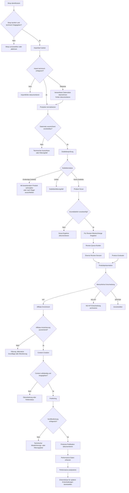

# Solvory – Fachlicher Produktworkflow

## Dokumentstatus

- **Status:** Entwurf
- **Dokumenttyp:** Fachlicher End-to-End-Workflow
- **Gültigkeitsbereich:** Produktlebenszyklus vom Shop bis zur Performance-Auswertung
- **Nicht Bestandteil dieses Dokuments:** Konkrete APIs, SQL-Schemata, Deployment-Jobs und technische Implementierung

## 1. Zweck

Dieses Dokument beschreibt den fachlichen Lebenszyklus eines Produkts innerhalb von Solvory.

Es definiert:

- die Reihenfolge der Prozessschritte,
- die Verantwortlichkeit jedes Services,
- Voraussetzungen für Übergänge,
- menschliche Entscheidungen,
- Ausnahme- und Fehlerpfade,
- die Rückkopplung aus Performance-Daten.

## 2. Grundprinzipien

1. Ein Produkt gelangt nicht direkt vom Import in die Veröffentlichung.
2. Technische Verarbeitbarkeit und fachliche Relevanz werden getrennt bewertet.
3. Der Product Scout trifft keine HIT-Entscheidung.
4. Der Product Evaluator berät, entscheidet aber nicht.
5. HIT, NO HIT und SPÄTER werden ausschließlich durch den Nutzer entschieden.
6. Affiliate-Anreicherung erfolgt nur für bestätigte HIT-Produkte.
7. Content-Erstellung und Veröffentlichung müssen einem konkreten HIT-Produkt zugeordnet sein.
8. Review-Sessions sollen divers sein.
9. Fehler dürfen nicht stillschweigend zu fachlichen Entscheidungen führen.
10. Jeder wesentliche Prozessschritt muss nachvollziehbar sein.

## 3. Fachlicher Gesamtprozess

## 4. Shopauswahl

### 4.1 Ziel

Vor dem Produktimport wird entschieden, ob ein Shop grundsätzlich als Solvory-Quelle geeignet ist.

### 4.2 Verantwortlicher Service

**Shop Management**

Source Management unterstützt bei der Verwaltung der technischen Quelle.

### 4.3 Bewertungskriterien

Die Shopbewertung kann insbesondere berücksichtigen:

- Passung zur Solvory-Marke,
- Wahrscheinlichkeit relevanter Problemlöser,
- Wahrscheinlichkeit ungewöhnlicher oder innovativer Produkte,
- Produktdatenqualität,
- Bildqualität,
- Feed-Verfügbarkeit,
- Affiliate-Verfügbarkeit,
- regionale Nutzbarkeit,
- Aktualität des Sortiments,
- technische Erreichbarkeit.

Die konkreten Mindestwerte und Freigabestufen sind noch nicht beschlossen.

### 4.4 Ergebnis

Mögliche fachliche Ergebnisse sind:

- freigegeben,
- zurückgestellt,
- abgelehnt,
- technisch noch zu prüfen.

Die verbindlichen Statusbezeichnungen sind noch festzulegen.

### 4.5 Fehler- und Ausnahmefälle

- Shop ist fachlich interessant, besitzt aber keinen nutzbaren Produktfeed.
- Shop besitzt einen Feed, aber keine ausreichenden Bilddaten.
- Affiliate-Programm ist noch nicht freigegeben.
- Shop führt überwiegend Standardprodukte ohne Solvory-Potenzial.
- Shopdaten sind regional oder rechtlich nicht nutzbar.

Ein technisches Problem darf nicht automatisch als fachliche Ablehnung gewertet werden.

## 5. Produktimport

### 5.1 Ziel

Produkte eines freigegebenen Shops werden kontrolliert in die zentrale Datenhaltung übernommen.

### 5.2 Verantwortlicher Service

**Product Import**

### 5.3 Eingaben

Mögliche Eingaben sind:

- Produktfeeds,
- Shop-Exporte,
- Affiliate-Netzwerk-Daten,
- andere ausdrücklich freigegebene Produktquellen.

Die konkreten Importkanäle werden je Shop dokumentiert.

### 5.4 Verarbeitung

Der Importprozess:

1. startet einen Importlauf,
2. dokumentiert Quelle und Shop,
3. liest Produktdatensätze,
4. validiert grundlegende technische Verarbeitbarkeit,
5. speichert verwertbare Produktinformationen,
6. ordnet Bilder zu,
7. dokumentiert Fehler und Laufstatus.

### 5.5 Ergebnis

Ein Importlauf kann sein:

- erfolgreich,
- teilweise erfolgreich,
- fehlgeschlagen.

Die konkreten Statusbezeichnungen sind noch festzulegen.

### 5.6 Fehlerpfade

- Quelle nicht erreichbar,
- ungültiges Datenformat,
- fehlende Pflichtinformationen,
- beschädigte Zeichenkodierung,
- ungültige URLs,
- nicht abrufbare Bilder,
- unerwartet große oder leere Datenmenge,
- Authentifizierungsfehler,
- Rate Limit,
- abgebrochener Lauf.

Verwertbare Datensätze dürfen bei einem Teilausfall nur übernommen werden, wenn der Teilerfolg eindeutig dokumentiert ist.

## 6. Produktnormalisierung

### 6.1 Ziel

Importierte Daten werden in eine konsistente, intern verarbeitbare Form überführt.

### 6.2 Verantwortlicher Service

**Product Normalization**

### 6.3 Mögliche Normalisierungsaufgaben

- Vereinheitlichung von Textformaten,
- Bereinigung leerer oder offensichtlich ungültiger Werte,
- Standardisierung von Preis- und Währungsdarstellungen,
- Bereinigung und Prüfung von URLs,
- Vereinheitlichung von Shop- und Markenbezeichnungen,
- Aufbereitung von Kategorien,
- Sortierung und Prüfung von Produktbildern,
- Trennung technischer Quellinformationen von fachlichen Produktinformationen.

Die konkreten Normalisierungsregeln sind noch zu dokumentieren.

### 6.4 Abgrenzung

Normalisierung darf keine unbelegte Produktinformation erfinden.

Fehlende Angaben dürfen nur ergänzt werden, wenn eine dokumentierte und verlässliche Quelle vorliegt.

### 6.5 Fehlerpfade

- Produkt ist technisch importiert, aber nicht ausreichend beschreibbar.
- Preis oder Währung sind widersprüchlich.
- Produktlink ist ungültig.
- Kein verwertbares Bild ist vorhanden.
- Titel und Beschreibung beziehen sich erkennbar auf unterschiedliche Varianten.

Solche Produkte werden nicht automatisch als NO HIT behandelt. Es handelt sich um technische oder datenbezogene Klärungsfälle.

## 7. Dublettenprüfung

### 7.1 Ziel

Mehrfache oder nahezu identische Produkte sollen erkannt werden, ohne relevante Varianten vorschnell zusammenzuführen.

### 7.2 Verantwortlicher Service

**Product Deduplication**

### 7.3 Zu prüfende Ähnlichkeiten

Die Prüfung kann unter anderem berücksichtigen:

- identische Quell- oder Produktkennung,
- identische Produkt-URL,
- identische oder ähnliche Titel,
- Marke und Modell,
- Bildähnlichkeit,
- technische Merkmale,
- Variantenbeziehungen,
- identisches Produkt in unterschiedlichen Shops.

Die verbindliche Dublettenlogik ist noch nicht beschlossen.

### 7.4 Ergebnisarten

- keine Dublette,
- eindeutige Dublette,
- mögliche Dublette,
- Produktvariante,
- shopübergreifend identisches Produkt.

Diese Begriffe sind fachliche Entwurfsbegriffe und noch nicht als Statusmodell beschlossen.

### 7.5 Behandlung

Eindeutige Dubletten sollen nicht mehrfach in derselben fachlichen Pipeline verarbeitet werden.

Historische Importinformationen sollen dennoch nachvollziehbar bleiben.

Unklare Fälle dürfen nicht automatisch gelöscht werden.

## 8. Scout-Auswahl

### 8.1 Ziel

Der Product Scout identifiziert Produkte, die eine nähere menschliche Betrachtung verdienen.

### 8.2 Verantwortlicher Service

**Product Scout**

### 8.3 Mindestkriterien

Ein Produkt ist grundsätzlich scoutwürdig, wenn:

1. es nützlich ist,
2. es eine tatsächliche funktionale Besonderheit besitzt.

### 8.4 Weitere Prüfaspekte

Der Product Scout kann berücksichtigen:

- Problemrelevanz,
- funktionalen Mehrwert,
- Unterschied zu Standardprodukten,
- Verständlichkeit des Nutzens,
- Zielgruppe,
- visuelle Darstellbarkeit,
- offensichtliche Risiken,
- Qualität der verfügbaren Produktdaten.

### 8.5 Entscheidungslogik

Der Product Scout soll im Zweifel eher ein potenziell relevantes Produkt vorlegen als es zu früh auszuschließen.

Er soll jedoch nicht übernehmen:

- offensichtlichen Datenmüll,
- unbrauchbare Datensätze,
- gewöhnliche Standardprodukte ohne funktionale Besonderheit,
- Produkte ohne erkennbaren Nutzen.

### 8.6 Ergebnis

Das Scout-Ergebnis enthält fachlich mindestens:

- das geprüfte Produkt,
- die Scout-Entscheidung,
- die Begründung,
- die verwendete Prompt- oder Regelversion,
- den Zeitpunkt der Prüfung.

Die konkrete technische Struktur wird im Datenmodell und später im SQL-Schema festgelegt.

### 8.7 Fehlerpfade

- KI-Ausgabe ist unvollständig.
- Scout-Begründung widerspricht der Entscheidung.
- Produktdaten reichen für eine Bewertung nicht aus.
- Prompt-Version ist nicht nachvollziehbar.
- externer KI-Dienst ist nicht verfügbar.

Ein technischer Scout-Fehler darf nicht als fachliche Ablehnung gespeichert werden.

## 9. Aufbau diverser Review-Sessions

### 9.1 Ziel

Scoutwürdige Produkte werden in überschaubare und abwechslungsreiche Review-Sessions gruppiert.

### 9.2 Verantwortlicher Service

**Review Queue Builder**

### 9.3 Diversitätsprinzip

Diversität ist wichtiger als vollständige Abarbeitung ähnlicher Produktgruppen.

Eine Session soll nach Möglichkeit unterschiedliche enthalten:

- Shops,
- Marken,
- Kategorien,
- Einsatzgebiete,
- Produkttypen.

Viele ähnliche Varianten eines Shops oder einer Marke sollen nach Möglichkeit auf unterschiedliche Sessions verteilt werden.

### 9.4 Voraussetzungen

Ein Produkt darf nur eingeplant werden, wenn:

- ein positives Scout-Ergebnis vorliegt,
- es nicht bereits endgültig entschieden wurde,
- es nicht aktiv in einer anderen offenen Session blockiert ist,
- die Produktdaten für die Darstellung ausreichen.

Die genauen Sperr- und Wiederholungsregeln sind noch festzulegen.

### 9.5 Session-Größe

Die bisherige Arbeitsweise verwendet Review-Sessions mit einer begrenzten Produktzahl.

Die verbindliche Größe für die mobile Web-App ist noch nicht abschließend beschlossen.

### 9.6 Fehlerpfade

- Nicht genügend diverse Produkte verfügbar.
- Zu viele ähnliche Produkte warten auf Review.
- Ein Produkt wurde zwischen Session-Erstellung und Review technisch gesperrt.
- Eine Session bleibt längere Zeit unvollständig.
- Ein Produkt erscheint versehentlich in mehreren aktiven Sessions.

## 10. Product-Evaluator-Beratung

### 10.1 Ziel

Der Product Evaluator unterstützt den Nutzer bei schwierigen oder vertiefungsbedürftigen Produktentscheidungen.

### 10.2 Verantwortlicher Service

**Product Evaluator**

### 10.3 Bewertungsaspekte

- Welches Problem wird gelöst?
- Wie relevant ist das Problem?
- Welche Zielgruppe besitzt dieses Problem?
- Was ist funktional besonders?
- Wie stark ist die Differenzierung?
- Ist der Nutzen leicht verständlich?
- Wie geeignet ist das Produkt für Pinterest?
- Wie überzeugend sind Produktbilder und Darstellung?
- Wie ist das Preis-Leistungs-Verhältnis?
- Welche Risiken, Schwächen oder Einwände bestehen?
- Wie gut passt das Produkt zu Solvory?

### 10.4 Ergebnis

Der Product Evaluator erstellt eine beratende Analyse.

Er trifft keine endgültige HIT-, NO-HIT- oder SPÄTER-Entscheidung.

### 10.5 Auslösung

Offen ist, ob der Evaluator:

- automatisch für jedes Review-Produkt,
- nur auf Anfrage,
- nur für unklare Fälle,
- oder abhängig von bestimmten Kriterien

ausgeführt wird.

## 11. Menschliche Produktentscheidung

### 11.1 Ziel

Der Nutzer trifft die endgültige interne Produktauswahl.

### 11.2 Verantwortlicher Service

**Human Review**

Die Entscheidung selbst wird durch den Nutzer getroffen.

### 11.3 Mögliche Entscheidungen

#### HIT

Das Produkt wird für die weitere Vermarktungspipeline freigegeben.

#### NO HIT

Das Produkt wird für den aktuellen fachlichen Auswahlprozess abgelehnt.

#### SPÄTER

Die Entscheidung wird zurückgestellt.

### 11.4 Anforderungen

Die Entscheidung muss:

- eindeutig einem Produkt zugeordnet sein,
- einer Review-Session zugeordnet sein,
- zeitlich nachvollziehbar sein,
- vor unbeabsichtigter Mehrfacherfassung geschützt sein.

### 11.5 Korrekturen

Noch offen ist:

- ob Entscheidungen nachträglich geändert werden dürfen,
- wer eine Änderung vornehmen darf,
- wie alte Entscheidungen historisch erhalten bleiben,
- ob eine Begründung verpflichtend ist.

### 11.6 NO-HIT-Behandlung

NO HIT ist keine technische Löschung.

Die Entscheidung muss nachvollziehbar bleiben.

Noch offen ist, ob und unter welchen Bedingungen ein NO-HIT-Produkt später erneut bewertet werden darf.

### 11.7 SPÄTER-Behandlung

Für zurückgestellte Produkte ist noch festzulegen:

- Wiedervorlagedatum,
- maximale Zurückstellungsdauer,
- erneute Session-Zuordnung,
- Priorisierungsregeln,
- Umgang mit geänderten Produktdaten.

## 12. Affiliate-Anreicherung

### 12.1 Ziel

Bestätigte HIT-Produkte werden mit nutzbaren Affiliate-Informationen verbunden.

### 12.2 Verantwortlicher Service

**Affiliate Enrichment**

### 12.3 Voraussetzung

Affiliate-Anreicherung erfolgt ausschließlich für bestätigte HIT-Produkte.

### 12.4 Zu verarbeitende Informationen

Fachlich relevant sind insbesondere:

- Shop,
- Affiliate-Netzwerk,
- ursprüngliche Produkt-URL,
- Affiliate-URL,
- Programm,
- Provisionsinformation, sofern verfügbar,
- Aktivitäts- oder Prüfstatus,
- Prüfzeitpunkt.

### 12.5 Grundsatz

Die Affiliate-Verfügbarkeit darf die vorherige HIT-Entscheidung nicht nachträglich inhaltlich verfälschen.

### 12.6 Fehlerpfade

- kein Affiliate-Programm verfügbar,
- Programm noch nicht freigegeben,
- Affiliate-Link kann nicht erzeugt werden,
- Link ist ungültig,
- Produkt ist im Affiliate-Feed nicht mehr vorhanden,
- Shop oder Programm wurde deaktiviert,
- mehrere mögliche Affiliate-Grundlagen stehen zur Verfügung.

Noch zu entscheiden ist, ob ein HIT ohne Affiliate-Link veröffentlicht werden darf.

## 13. Content-Erstellung

### 13.1 Ziel

Für ein bestätigtes und ausreichend angereichertes Produkt werden Pinterest-taugliche Inhalte erstellt.

### 13.2 Verantwortlicher Service

**Content Creation**

### 13.3 Fachliche Bestandteile

Mögliche Content-Bestandteile sind:

- Pin-Titel,
- Beschreibung,
- Hook,
- Overlay-Text,
- Bildkonzept oder Bild-Prompt,
- Hashtags,
- Call-to-Action,
- Verknüpfung zum Produkt und Affiliate-Link.

Die konkreten Pflichtbestandteile sind noch verbindlich festzulegen.

### 13.4 KI-Nutzung

Bei KI-gestützter Content-Erstellung muss die verwendete Prompt-Version nachvollziehbar sein.

KI-Ausgaben müssen strukturell und fachlich validiert werden.

### 13.5 Fehlerpfade

- unvollständige Ausgabe,
- unbelegte Produktversprechen,
- Widerspruch zu Produktdaten,
- unzulässiger Kaufdruck,
- ungeeignetes Bildmaterial,
- fehlender Affiliate-Link,
- Duplikat zu bereits veröffentlichtem Content,
- Inhalt entspricht nicht den Plattformvorgaben.

## 14. Veröffentlichung

### 14.1 Ziel

Freigegebene Content-Assets werden kontrolliert auf Pinterest veröffentlicht.

### 14.2 Verantwortlicher Service

**Publishing**

### 14.3 Voraussetzungen

Vor Veröffentlichung muss mindestens sichergestellt sein:

- Produkt ist HIT,
- Content ist vollständig,
- Veröffentlichungsfreigabe liegt vor,
- Zielplattform ist definiert,
- Ziel-URL ist gültig,
- keine unbeabsichtigte Doppelveröffentlichung liegt vor.

### 14.4 Verarbeitung

Publishing:

1. übernimmt freigegebenen Content,
2. übermittelt ihn an Pinterest,
3. dokumentiert den technischen Status,
4. speichert die externe Publikationsreferenz,
5. dokumentiert Fehler oder Wiederholungen.

### 14.5 Fehlerpfade

- Pinterest-Authentifizierung fehlgeschlagen,
- Plattform lehnt Content ab,
- Rate Limit,
- Netzwerkfehler,
- externer Beitrag wurde erstellt, interne Bestätigung fehlt,
- interner Status zeigt Erfolg, externer Beitrag fehlt,
- doppelte Veröffentlichung nach Wiederholung.

Publishing-Wiederholungen müssen idempotent oder anderweitig gegen Duplikate geschützt werden. Die technische Lösung ist noch nicht beschlossen.

## 15. Performance-Rückkopplung

### 15.1 Ziel

Ergebnisse veröffentlichter Inhalte werden dem ursprünglichen Produkt und Content zugeordnet.

### 15.2 Verantwortlicher Service

**Performance Analytics**

### 15.3 Mögliche Kennzahlen

Bisher fachlich relevante Kennzahlen sind:

- Impressionen,
- Klicks,
- Klickrate,
- Saves,
- Affiliate-Klicks,
- Verkäufe,
- Provision.

Welche Kennzahlen technisch verfügbar sind, hängt von Pinterest und den Affiliate-Grundlagen ab.

### 15.4 Verarbeitung

Performance Analytics:

1. erfasst plattformbezogene Messwerte,
2. ordnet sie der Veröffentlichung zu,
3. führt sie auf Content und Produkt zurück,
4. speichert Tageswerte,
5. erstellt Auswertungen und Empfehlungen.

### 15.5 Rückkopplung

Performance-Daten können später genutzt werden für:

- Verbesserung von Scout-Kriterien,
- Verbesserung des Product Evaluators,
- Verbesserung der Content-Erstellung,
- Priorisierung von Produkttypen,
- Bewertung von Shops,
- Analyse von Kategorien und Zielgruppen.

Performance darf nicht rückwirkend die historische menschliche Entscheidung überschreiben.

### 15.6 Fehlerpfade

- Messdaten fehlen,
- externe Werte wurden nachträglich korrigiert,
- Publikationsreferenz ist nicht zuordenbar,
- mehrere Pins verweisen auf dasselbe Produkt,
- Affiliate-Sale ist nicht eindeutig zuordenbar,
- Zeitzonen oder Berichtszeiträume stimmen nicht überein.

## 16. Automation Monitoring

### 16.1 Ziel

Technische Prozessläufe werden nachvollziehbar überwacht.

### 16.2 Verantwortlicher Service

**Automation Monitoring**

### 16.3 Überwachte Prozesse

- Import,
- Normalisierung,
- Dublettenprüfung,
- Scout-Läufe,
- Evaluator-Läufe,
- Content-Erstellung,
- Publishing,
- Performance-Importe.

### 16.4 Fehlerbehandlung

Ein Fehlerlauf muss mindestens:

- identifizierbar sein,
- dem betroffenen Prozess zugeordnet sein,
- einen technischen Status besitzen,
- ausreichend Fehlerkontext liefern,
- von einem fachlichen Ablehnungsergebnis unterscheidbar sein.

## 17. Zuständigkeitsübersicht

| Prozessschritt | Verantwortlicher Service | Ergebnis |
|---|---|---|
| Quellenverwaltung | Source Management | verwaltete Produktquelle |
| Shopbewertung | Shop Management | freigegebener, zurückgestellter oder abgelehnter Shop |
| Produktimport | Product Import | dokumentierter Importlauf und importierte Produktdaten |
| Normalisierung | Product Normalization | konsistente Produktdaten |
| Dublettenprüfung | Product Deduplication | Dublettenstatus oder Klärungsfall |
| Scout-Auswahl | Product Scout | Scout-Ergebnis |
| Session-Aufbau | Review Queue Builder | diverse Review-Session |
| Produktberatung | Product Evaluator | beratende Analyse |
| Endentscheidung | Human Review / Nutzer | HIT, NO HIT oder SPÄTER |
| Affiliate-Anreicherung | Affiliate Enrichment | Affiliate-Link und Programminformationen |
| Content-Erstellung | Content Creation | Content-Assets |
| Veröffentlichung | Publishing | dokumentierte Pinterest-Publikation |
| Performance-Auswertung | Performance Analytics | Tageswerte und Auswertung |
| Laufüberwachung | Automation Monitoring | technischer Lauf- und Fehlerstatus |

## 18. Allgemeine Ausnahmeprinzipien

### 18.1 Technischer Fehler ist keine fachliche Ablehnung

Ein fehlgeschlagener Import, KI-Aufruf oder Publishing-Vorgang darf nicht als NO HIT oder fachliche Ablehnung interpretiert werden.

### 18.2 Historie vor Überschreibung

Wichtige Entscheidungen und Ausführungsergebnisse sollen historisch nachvollziehbar bleiben.

### 18.3 Wiederholbarkeit

Technische Prozesse sollen wiederholbar sein, ohne unkontrolliert:

- doppelte Produkte,
- doppelte Scout-Ergebnisse,
- doppelte Reviews,
- doppelte Content-Assets,
- doppelte Veröffentlichungen

zu erzeugen.

### 18.4 Manuelle Klärung

Unklare Fälle sollen einen erkennbaren Klärungsstatus erhalten, statt stillschweigend automatisch entschieden zu werden.

## 19. Offene Entscheidungen

- Verbindliche Shopstatus und Freigabekriterien.
- Verbindliche Importstatus.
- Technische Mindestinformationen für ein verarbeitbares Produkt.
- Konkrete Normalisierungsregeln.
- Konkrete Dublettenregeln.
- Behandlung shopübergreifend identischer Produkte.
- Verbindliche Review-Session-Größe.
- Regeln für gleichzeitige Session-Zuordnung.
- Auslöselogik des Product Evaluators.
- Pflichtbegründungen bei HIT, NO HIT oder SPÄTER.
- Änderbarkeit menschlicher Entscheidungen.
- Wiedervorlageprozess für SPÄTER.
- Wiederaufnahmeprozess für NO HIT.
- Veröffentlichung von HIT-Produkten ohne Affiliate-Link.
- Content-Freigabeprozess.
- Publishing-Zeitplanung.
- Retry-Regeln und maximale Wiederholungszahl.
- Verbindliche Performance-Kennzahlen.
- Nutzung von Performance-Daten für spätere automatisierte Bewertungen.

---

# Verbindliche Einarbeitung der fachlichen Entscheidungen

Die folgenden Regeln gelten verbindlich und ersetzen entgegenstehende oder noch offene Formulierungen:

1. Der Product Scout prüft ausschließlich neue Produkte und nimmt bei fachlicher Unsicherheit eher auf.
2. NO HIT sperrt das Produkt dauerhaft für den regulären Auswahlprozess. Es gibt keine automatische Wiederaufnahme.
3. SPÄTER wird ausschließlich bei relevanter Produktänderung erneut vorgelegt; nicht zeitgesteuert und ohne erneuten Scout-Lauf.
4. Relevante Änderungen sind insbesondere Preis, Bilder, Produktversion, Funktion, Beschreibung oder Verfügbarkeit.
5. Product Evaluator läuft nur auf ausdrückliche Nutzeranforderung und wird nicht dauerhaft operativ gespeichert.
6. Nach HIT startet die Orchestrierung Affiliate Enrichment und Content Creation parallel.
7. Publishing bleibt ohne gültigen Ziel-Link blockiert.
8. Publishing unterstützt sofortige und geplante Veröffentlichung.
9. Produkte dürfen ohne Affiliate-Link importiert, gescoutet, evaluiert und bewertet werden.
10. Eine NO-HIT-Begründung ist nicht erforderlich. Mindestens gespeichert werden Produkt, Entscheidung, Zeitpunkt und entscheidender Benutzer.
11. Dasselbe fachliche Produkt kann mehrere Angebote besitzen; Varianten gehören zu Produktfamilien.
12. Die bevorzugte technische Quellenreihenfolge lautet API, Feed, CSV/XML, strukturierte Website-Daten, Scraping.
13. Alle verfügbaren Produktbilder werden erfasst.
14. KI-Persistenz ist auf strukturierte Endergebnisse und Ausführungsmetadaten begrenzt.
